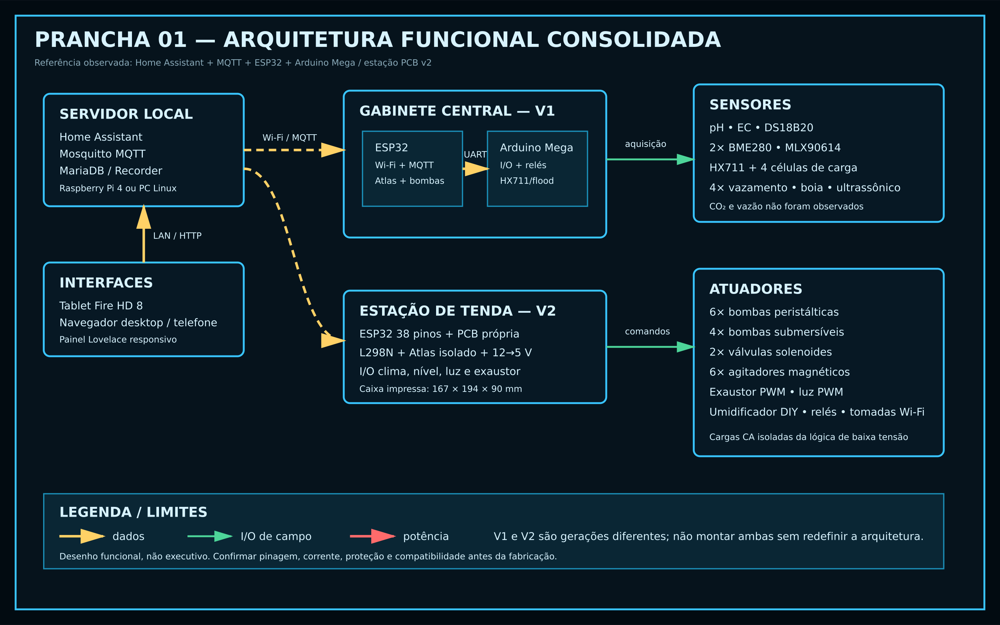
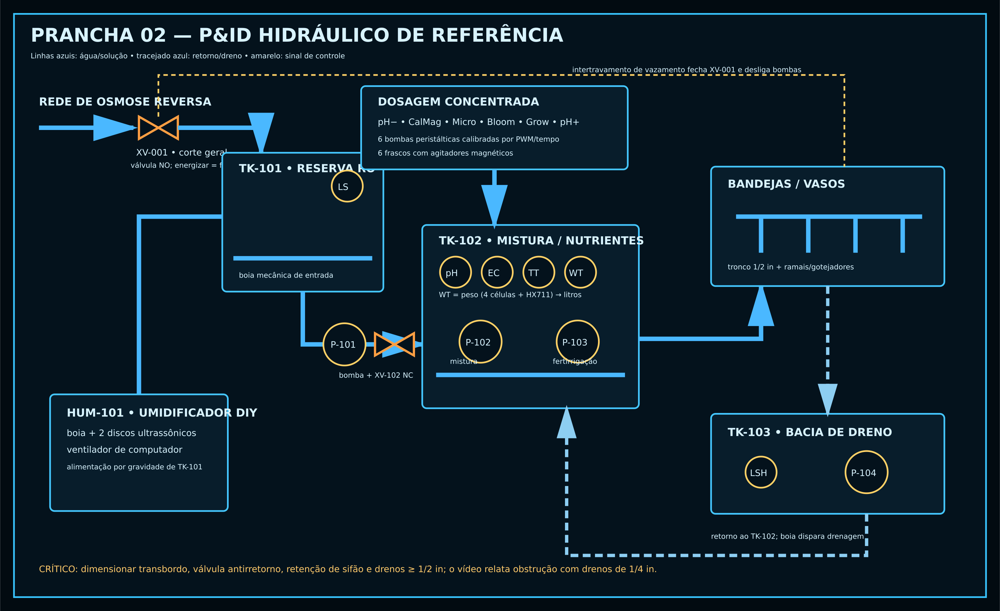
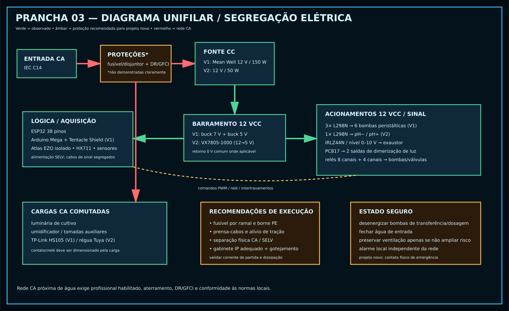
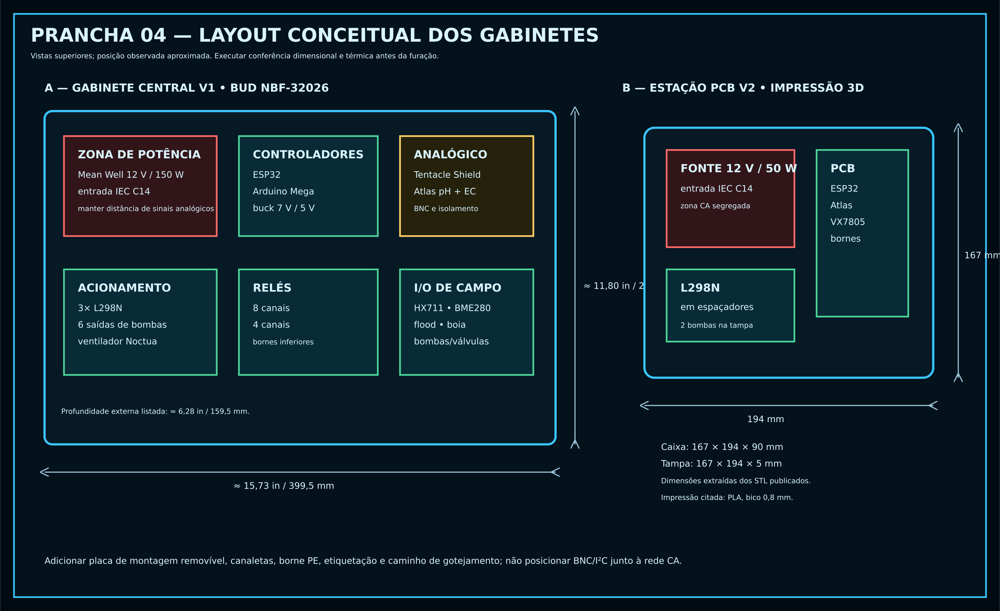
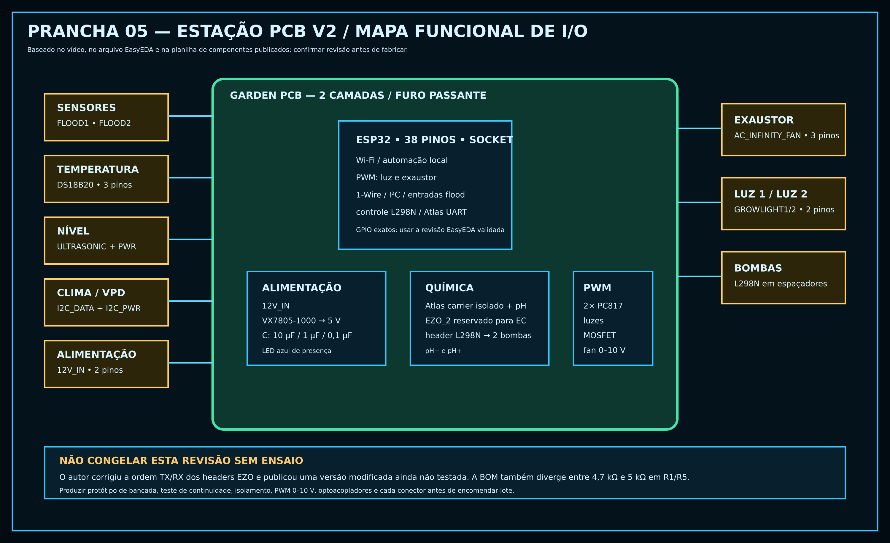
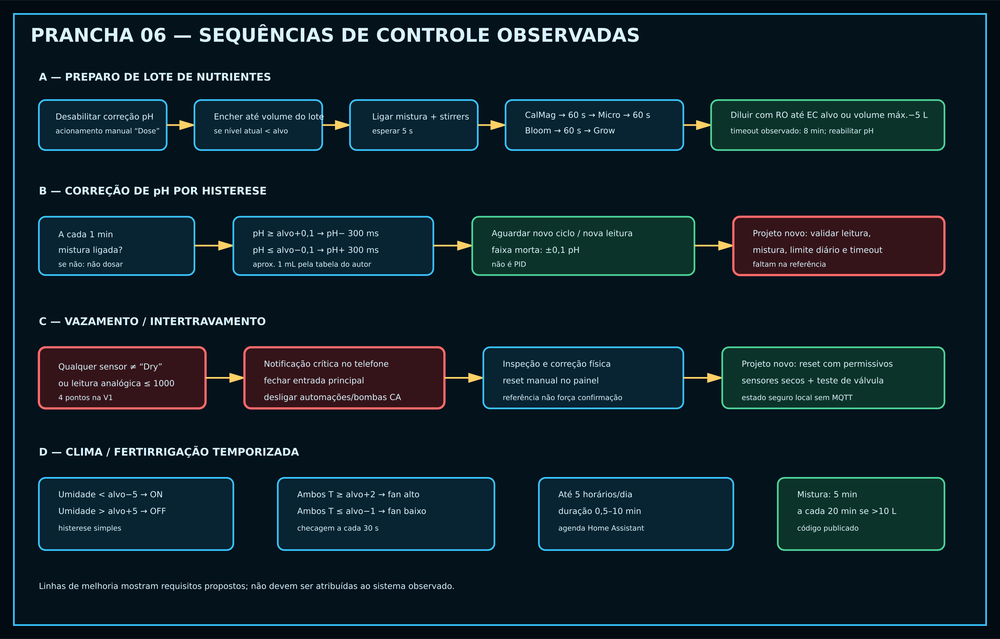

# Especificação de Referência — Sistema de Automação de Cultivo

**Arquivo:** `ESPECIFICACAO_REFERENCIA.md`  
**Escopo:** engenharia reversa documental de quatro vídeos, conferida contra os arquivos open-source publicados pelo autor.
**Objetivo:** servir como referência técnica e backlog para uma implementação nova; não é uma autorização para copiar cegamente uma revisão de hardware não ensaiada.

> **Segurança:** o sistema combina água, fertilizantes concentrados e rede elétrica. A execução deve usar aterramento, DR/GFCI, proteção por sobrecorrente, segregação entre CA e SELV, gabinete compatível, alívio de tração e profissional habilitado conforme as normas locais. As pranchas são funcionais/conceituais, não desenhos executivos certificados.

> **Aplicação no projeto próprio:** este arquivo preserva tudo que foi observado,
> inclusive iluminação, para manter a fidelidade documental. O escopo executável
> da v1.0 está em [`docs/ESCOPO_V1.md`](docs/ESCOPO_V1.md), exclui completamente
> a elétrica da iluminação e admite somente integração lógica opcional com as
> tomadas existentes. Itens marcados `[REF-FORA]` não pertencem ao backlog.

## Convenções e rastreabilidade

| Identificador | Material analisado | Duração |
|---|---|---:|
| V1 | [My DIY Home Assistant Garden Automation System — Pt.1 Hardware](https://www.youtube.com/watch?v=Q9fjKeYOyqU) | 16:36 |
| V2 | [Update on My Automated Garden System](https://www.youtube.com/watch?v=SMWJXIhill8) | 05:56 |
| V2F | [My DIY Home Assistant Garden Automation System — Pt.2 Functionality](https://www.youtube.com/watch?v=XjcLWVci6_I) | 18:00 |
| V3 | [Rebuilding My Automated Hydroponic Garden #5 — Designing the PCBs](https://www.youtube.com/watch?v=SrGKJrS0PVs) | 13:43 |

A conferência quadro a quadro do anexo V2F, seu hash e a matriz de aplicação
estão em [`docs/referencia/REVISAO_VIDEO_PARTE2_FUNCIONALIDADES.md`](docs/referencia/REVISAO_VIDEO_PARTE2_FUNCIONALIDADES.md).

Fontes auxiliares publicadas pelo próprio criador: [repositório `ledgardener/gardenAutomation`](https://github.com/ledgardener/gardenAutomation), [lista de peças da geração V1](https://github.com/ledgardener/gardenAutomation/blob/master/parts_list_with_links.md), [firmware e configuração do Home Assistant](https://github.com/ledgardener/gardenAutomation/tree/master) e [pacote de PCB/3D no Dropbox](https://www.dropbox.com/sh/vm5qaalidt2vkax/AADD1yOENif5DczTDZ2ULJv0a?dl=0).

Nos requisitos da seção 6:

- **[OBS-V1]** foi observado nos vídeos V1/V2 ou no código V1 publicado;
- **[OBS-V2]** foi observado no redesenho com PCB do vídeo V3 ou nos arquivos EasyEDA/BOM/3D publicados;
- **[REP]** é necessário para reproduzir de forma controlada um comportamento observado;
- **[MEL]** é uma oportunidade de melhoria, não uma capacidade atribuída ao original.

## 1. Visão geral do sistema de referência

### 1.1 Vídeo V1 — hardware da primeira geração

O primeiro vídeo apresenta uma automação residencial construída durante aproximadamente um ano de tempo livre para uma tenda de 4 × 4 pés. O arranjo parte de água de osmose reversa, possui corte geral de água por solenoide, reservatório superior, reservatório de mistura pesado por quatro células de carga, medição de pH/EC/temperatura da solução, seis bombas peristálticas para concentrados, bombas submersíveis para transferência, mistura, fertirrigação e drenagem, umidificador ultrassônico caseiro, exaustor com PWM interceptado, iluminação agendada e quatro pontos de detecção de vazamento. O controle central é distribuído entre Home Assistant, ESP32 e Arduino Mega com Tentacle Shield; o protótipo usa protoboards, fios Dupont, relés, drivers L298N, tomadas Wi-Fi e uma fonte Mean Well de 12 V. O autor mostra falhas reais — cinco alagamentos em uma noite, drenos de 1/4 pol obstruídos e sensor eTape de nível instável — que motivaram alterações mecânicas e o uso de balança.

### 1.2 Vídeos V2/V2F — atualização, painel e publicação do código

O segundo vídeo mostra a integração operacional: Home Assistant em Raspberry Pi 4, MQTT pela rede Wi-Fi, painel em tablet Amazon Fire HD 8 e a mesma interface em desktop/telefone. São exibidas telas de operação, calibração, controle manual, receita de nutrientes, clima, agenda de até cinco fertirrigações, diagnóstico do host e uma interface separada de medição PPFD por CNC. O painel permite calibrar pH, EC, balança e vazão das bombas, selecionar alvos, dosar um lote por mL/L, comandar relés/tomadas e ajustar PWM de luz/exaustor. O autor afirma ter gasto mais de um mês de tempo livre limpando o código e organizando MQTT antes de publicar o diagrama fio a fio, lista de peças e arquivos do sistema; também declara que foi seu primeiro projeto de programação.

### 1.3 Vídeo V3 — redesenho por estação e PCB própria

O terceiro vídeo migra do gabinete central prototipado para estações por tenda, cada uma em caixa impressa em 3D, com fonte de 12 V/50 W e PCB de duas camadas desenhada no EasyEDA. A placa recebe ESP32 de 38 pinos, regulador VX7805-1000, módulo L298N para duas bombas de pH, carrier isolado Atlas com sonda de pH e posição futura para EC, entradas de vazamento, DS18B20, nível ultrassônico, I²C para placa VPD, duas saídas optoisoladas de dimerização e saída 0–10 V para exaustor AC Infinity com motor EC. O autor escolhe componentes through-hole para soldagem manual, demonstra o fluxo esquema→layout→Gerber→JLCPCB e corrige durante o vídeo a ordem dos pinos de dados EZO. Tanto o vídeo quanto o README alertam que é um primeiro projeto de circuito, não certificado e que a revisão modificada ainda não foi testada.

### 1.4 Síntese consolidada

O princípio central é uma arquitetura local e modular: Home Assistant coordena horários, receitas, UI, histórico e notificações; microcontroladores transformam MQTT em aquisição/acionamento de campo; a hidráulica prepara solução em batelada e recircula drenagem; clima, iluminação e irrigação usam regras simples. Não há evidência de PID: pH, umidade e temperatura usam histerese/degraus; fertirrigação e luz usam agenda; nutrientes são dosados por receita feed-forward e a EC é atingida por diluição com RO. A geração V1 é funcional, mas experimental e dependente do servidor; a V2 reduz a fiação com uma PCB por tenda, porém os arquivos publicados devem ser tratados como protótipo não validado.

[Abrir prancha vetorial 01](desenhos/PRANCHA-01_ARQUITETURA.svg)

## 2. Inventário de hardware

### 2.1 Controle, energia e interface

| Componente | Função | Modelo/marca se identificado | Observações / geração |
|---|---|---|---|
| Servidor Home Assistant | Orquestração, UI, automações, MQTT e histórico | Raspberry Pi 4 4 GB; depois PC desktop antigo | O Pi funcionou por mais de um ano, mas ficou lento com automações/dados; migração para PC foi descrita como simples (V1 09:01–09:57). |
| Tablet | Painel fixo | Amazon Fire HD 8 | UI também acessada em desktop e telefone. |
| Microcontrolador Wi-Fi central | MQTT, Atlas, bombas e ponte serial | ESP32 | No firmware V1 usa `WiFi`, `PubSubClient`, I²C, DS18B20, BME280 e `Serial2`. |
| Controlador de I/O | Relés, vazamento, boia, HX711 | Arduino Mega | Comunica-se com ESP32 por UART a 115200 bit/s. |
| Nó provisório da tenda | Clima e PWM | ESP32 + ESP8266 visíveis/mencionados | Montagem em breadboard; autor diz que poderia ser consolidada em um ESP32. A versão ESPHome publicada usa ESP32. |
| Interface de sondas | Isolamento e encaixe de circuitos EZO | Whitebox Labs Tentacle Shield | Geração V1, instalada sobre o Mega. |
| Carrier isolado de pH | Interface elétrica da sonda | Atlas Scientific isolated carrier board | Geração PCB V2; um segundo header EZO é reservado para EC. |
| Fonte principal V1 | Barramento CC | Mean Well LRS-150-12, 12 V/150 W | Modelo confirmado no diagrama/lista publicados. |
| Fonte de estação V2 | Barramento CC | 12 V/50 W | Marca não legível/confirmada; o desenho do autor representa fonte compacta. |
| Conversores V1 | 12→7 V e 12→5 V | 2× D-ROK/LM2596 | 7 V para processadores e 5 V para outros eletrônicos, conforme narração. |
| Regulador V2 | 12→5 V | VX7805-1000 | Módulo through-hole, BOM DigiKey 102-4253-ND. |
| Entrada de rede | Alimentação do gabinete | IEC C14 com chave | Proteções internas não ficam suficientemente demonstradas. |
| Gabinete V1 | Abriga eletrônica | BUD NBF-32026 + painel NBX-32926-PL | Dimensões listadas: aprox. 399,5 × 299,7 × 159,5 mm. |
| Caixa de estação V2 | Abriga fonte/PCB | STL “Station Box v3” | Dimensões extraídas: 167 × 194 × 90 mm; tampa 167 × 194 × 5 mm; PLA, bico 0,8 mm citado. |
| Suporte de régua V2 | Fixação externa | STL “Tuya PB Holder 2” | Envelope do STL: 105 × 111 × 39 mm. |
| Relés | Comutação de bombas/válvulas/agitadores | Elegoo 8 canais + 4 canais, ativos em nível baixo | Doze saídas endereçadas no firmware do Mega. |
| Drivers de motor V1 | PWM/direção de seis bombas | 3× módulos L298N | Cada módulo atende duas bombas peristálticas. |
| Driver de motor V2 | Duas bombas de pH | 1× módulo L298N | Montado em espaçadores sobre a PCB. |
| Tomadas inteligentes V1 | Cargas CA | 3× TP-Link HS105 | Usadas para luz/umidificador e outras cargas; resposta descrita como rápida. |
| Régua inteligente V2 | Bombas de agitação/alimentação | Tuya Wi-Fi power strip | Montada em suporte impresso separado. |
| Optoacopladores | Dimerização isolada | 2× PC817/BPC-817 | Somente para drivers de luz com entrada de dimerização autossuprida de dois fios. |
| MOSFET V1 | Interface PWM do exaustor | IRLZ44N | Confirmado no diagrama/parts list V1. |
| MOSFET V2 | Conversão PWM 3,3→0–10 V | ZVNL120A no BOM; 2N7000 aparece em metadado EasyEDA | Divergência a validar antes de comprar. |
| Ventilador interno | Refrigeração do gabinete | Noctua/PC fan | Firmware V1 fixa PWM em 125/255. |

### 2.2 Sensores

| Componente | Função | Modelo/marca se identificado | Observações |
|---|---|---|---|
| Sonda de pH | Acidez da solução | Kit Atlas Scientific pH + circuito EZO | Endereço I²C 99 na V1; BNC com extensão feita pelo autor. |
| Sonda de EC | Condutividade | Kit Atlas Scientific EC K1.0 + EZO | Endereço I²C 100 na V1; posição futura na V2. |
| Sensor de água | Temperatura da solução | DS18B20 à prova d’água | 1-Wire; usado para exibição/compensação. |
| Sensores de clima V1 | Temperatura/umidade | 3× BME280 na parts list | Um no gabinete; dois na tenda. ESPHome usa endereços 0x76 e 0x77. |
| Sensor infravermelho | Temperatura de superfície foliar | MLX90614 | Integra a placa VPD V2 com dois BME280. |
| Células de carga | Massa do tanque→litros | 4 células + HX711 | Sanduíche entre placas de madeira; calibração e tara persistidas em EEPROM. |
| Sensor de nível descartado | Nível contínuo | eTape | Leitura descrita como instável; substituído por balança. |
| Sensor ultrassônico | Nível de reservatório | Modelo não identificado | Instalado na V2, mas o autor diz que ainda não foi programado. |
| Sensores de vazamento V1 | Água no piso/armário | 4× módulos resistivos de umidade | Entradas A0–A3; limiar bruto `<=1000` no firmware. |
| Sensores de vazamento V2 | Água condutiva em cabo nu | Eletrodos/cabo, modelo não identificado | Solução nutritiva é detectada; água pura não foi confiável. |
| Boia do dreno | Indica bacia cheia | Madison M8000 | Entrada digital com `INPUT_PULLUP`. |
| Boias mecânicas | Limitam enchimento | Modelos não identificados | Uma no reservatório RO e outra no reservatório de mistura. |
| Sensor de CO₂ | — | Não observado | Não há hardware, tela ou lógica identificada. |
| Sensor de vazão | — | Não observado | Vazão das peristálticas é inferida por calibração temporal, não medida em linha. |

### 2.3 Atuadores e hidráulica

| Componente | Função | Modelo/marca se identificado | Observações |
|---|---|---|---|
| Bombas peristálticas | pH−, CalMag, Micro, Bloom, Grow, pH+ | 6 unidades, modelo genérico | PWM individual e tempo de acionamento determinam volume; tabela do autor indica ~1 mL/300 ms na calibração mostrada. |
| Bombas submersíveis | Transferência RO, mistura, fertirrigação e retorno do dreno | 4× Vivosun 800 GPH listadas | A função da quarta bomba é consolidada pelo diagrama como retorno do dreno. |
| Válvula de corte geral | Intertravamento da entrada RO | Solenoide 12 V normalmente aberta | A automação energiza para fechar quando há vazamento. |
| Válvula entre reservatórios | Evita sifonamento e controla transferência | Solenoide 12 V normalmente fechada | Opera junto da bomba RO→mistura. |
| Exaustor V1 | Remoção de calor/umidade | AC Infinity Cloudline T6, motor CC antigo | PWM interno interceptado; solução experimental. |
| Exaustor V2 | Controle climático | AC Infinity Cloudline série S, motor EC | Terminal de 0–10 V permite usar o fan sem controlador “smart”. |
| Luminária | Fotoperíodo/dimerização | Driver Mean Well Type B, Inventronics ou HLG citados como compatíveis | V1 inicialmente apenas agendada; PWM/dimerização aparece na atualização/V2. Modelo/potência da luminária não identificados. |
| Umidificador DIY | Eleva UR | 2 discos ultrassônicos + ventilador de PC | Tanque com boia alimentado por RO. |
| Agitadores magnéticos | Homogeneízam concentrados | 6× Arctic F8 PWM fans + 12 ímãs + 6 barras PTFE listados | Frascos tipo Mason; ligados por relés. |
| Rede de irrigação | Distribui solução | Tronco 1/2 pol + múltiplos ramais/gotejadores | “Spaghetti” de tubos é mostrado; emissores exatos não identificados. |
| Drenos de vasos | Levam runoff à bacia comum | 1/4 pol na montagem problemática | Autor considera subdimensionado e planeja 1/2 pol. |
| Reservatório RO | Reserva e alimenta mistura/umidificador | Recipiente plástico, volume não identificado | Entrada com boia mecânica. |
| Reservatório de mistura | Preparo/recirculação | Recipiente plástico, volume não identificado | Montado sobre balança DIY; faixa do painel sugere até 60 L por lote, não prova capacidade física. |
| Bacia de dreno | Coleta retorno | Recipiente plástico + boia | Bomba devolve solução ao tanque de mistura. |

[Abrir prancha vetorial 02](desenhos/PRANCHA-02_PID_HIDRAULICO.svg)

### 2.4 Componentes identificados na BOM da PCB V2

| Ref./quantidade | Item | Código informado |
|---|---|---|
| 9× blocos de 2 vias, passo 5,0 mm | `12V_IN`, `FLOOD1`, `FLOOD2`, `GROWLIGHT1`, `GROWLIGHT2`, `I2C_DATA`, `I2C_PWR`, `ULTRASONIC`, `ULTRASONIC_PWR` | WM20109-ND |
| 2× blocos de 3 vias, passo 5,0 mm | `AC_INFINITY_FAN`, `DS18B20` | WM20110-ND |
| C1/C2/C3 | 10 µF / 1 µF / 0,1 µF | 493-5362-1-ND / 493-5383-1-ND / 399-4264-ND |
| LED1 | LED azul 5 mm | C503B-BCN-CV0Z0461-ND |
| 2× headers de 19 vias | Soquete do ESP32 | S7017-ND |
| 3× headers de 4 vias | `EZO_1`, `EZO_2`, `L298N` | S7002-ND |
| Q1 | MOSFET para fan | ZVNL120A-ND na planilha |
| U3 | Regulador 5 V | VX7805-1000 / 102-4253-ND |
| U1/U4 | Optoacopladores | BPC-817/PC817 |
| R1/R5 | 4,7 kΩ na planilha | O metadado EasyEDA também registra 5 kΩ; confirmar. |
| R2/R7/R8 | 10 kΩ | Through-hole |
| R3/R4/R6/R9 | 220 Ω | Through-hole |

[Abrir prancha vetorial 03](desenhos/PRANCHA-03_UNIFILAR_ELETRICO.svg)

[Abrir prancha vetorial 04](desenhos/PRANCHA-04_LAYOUT_GABINETE.svg)

[Abrir prancha vetorial 05](desenhos/PRANCHA-05_PCB_V2_IO.svg)

## 3. Arquitetura de firmware e lógica de controle

### 3.1 Particionamento do controle

1. **Home Assistant:** contém regras, horários, setpoints, scripts de batelada, históricos, notificações e painel.
2. **ESP32 central V1:** cliente Wi-Fi/MQTT, leitura Atlas/temperaturas, PWM das seis peristálticas e ponte serial com o Mega.
3. **Arduino Mega V1:** relés, quatro sensores de vazamento, boia da bacia e balança HX711.
4. **ESPHome da tenda:** dois BME280, PWM de luz e exaustor; usa API nativa do Home Assistant, OTA e portal cativo.
5. **Estação PCB V2:** pretende concentrar por tenda ESP32, pH, futuro EC, clima/VPD, nível, vazamento, luz, fan e duas bombas. O vídeo não demonstra o firmware final dessa revisão.

### 3.2 Fertirrigação e preparo de solução

O usuário define volume do lote e concentrações em mL/L para CalMag, Micro, Bloom e Grow. O script desabilita correção automática de pH; transfere RO até o volume do lote se necessário; liga mistura; após 5 s liga agitadores; dosa CalMag, espera 60 s, dosa Micro, espera 60 s, dosa Bloom, espera 60 s e dosa Grow; desliga agitadores; espera 60 s; acrescenta RO até atingir EC alvo ou chegar a `volume_máximo−5 L`, com timeout de 8 min; então reabilita o pH. Portanto, EC não fecha a malha por adição incremental de nutrientes: a receita adiciona concentrado em malha aberta e a etapa final dilui para baixo.

A fertirrigação diária possui frequência 0–5 e até cinco horários. Cada evento liga a bomba pelo tempo configurado (0,5–10 min) e desliga. A bomba de mistura opera por 5 min a cada 20 min quando o tanque contém mais de 10 L no código publicado; a fala do V1 menciona “aproximadamente a cada 10 minutos”, logo o código é a fonte mais específica da revisão publicada. A bacia de dreno é verificada a cada 30 s: ao ficar cheia, há espera de 30 s, bombeamento até a boia normalizar ou 8 min, seguido de 1 min adicional.

### 3.3 pH, EC e calibração

- O ESP32 alterna consulta a pH (endereço I²C 99) e EC (100) a cada 5 s; cada variável recebe nova tentativa aproximadamente a cada 10 s.
- A compensação por temperatura roda a cada 10 min se a água estiver entre 10 e 30 °C. No código efetivo, o comando de compensação é enviado explicitamente ao circuito de pH; a compensação do EC não fica implementada de modo equivalente.
- A correção de pH avalia a cada minuto e só dosa se a bomba de mistura estiver ligada: `pH >= alvo+0,1` aciona pH− por 300 ms; `pH <= alvo−0,1` aciona pH+ por 300 ms. É controle por histerese/degrau, não PID.
- Soluções de calibração codificadas: pH 7,00/4,00/10,00 e EC dry/700/2000. A UI instrui segurar cada botão de calibração por 3 s.
- A balança admite tara e fator de calibração; ambos são gravados na EEPROM do Mega. A massa em kg é tratada como litros de água aproximadamente 1:1.
- O PWM de cada bomba é ajustável. O comentário do firmware registra, a 13,045 V, valores 210/204/211/206/205/210 para pH−/CalMag/Micro/Bloom/Grow/pH+ e uma curva aproximada de 1 mL/300 ms a 10 mL/3000 ms.

### 3.4 Clima, VPD, iluminação e exaustão

O ESPHome lê dois BME280 a cada 30 s. O segundo recebe offsets de +0,4 °C e +4,0% UR, o que revela correção empírica entre unidades. O umidificador usa banda de ±5% UR: liga abaixo de `alvo−5` e desliga acima de `alvo+5`. O fan é verificado a cada 30 s: vai para alto se **ambas** as temperaturas forem pelo menos `alvo+2 °C`, e para baixo se **ambas** forem no máximo `alvo−1 °C`. Leituras discordantes não produzem uma política degradada explícita.

O ESPHome publicado define luz em GPIO 27, LEDC 1220 Hz, saída invertida e gamma 1,0; fan em GPIO 25, 6180 Hz, com presets aproximados low=5%, medium=20% e high=100%. O fotoperíodo é por horários de ligar/desligar. O V1 fala de sunrise/sunset e canais vermelho/azul como intenção futura, não como função confirmada. A placa VPD V2 reúne dois BME280 e MLX90614; um dos quatro conjuntos usados pelo autor apresentava leitura absurda em cabo I²C de 10–15 pés, levando à proposta de um D1 mini local com comunicação sem fio.

### 3.5 Segurança, falhas e notificações observadas

- Qualquer mudança do sensor agregado de vazamento para fora de `Dry` dispara notificação crítica no telefone, energiza a válvula normalmente aberta para fechar a entrada principal, desabilita automações de fertirrigação e desliga quatro saídas CA da régua.
- O reset é manual no painel: reabilita automações, desenergiza a válvula de corte e publica `Dry`. O script não exige inspeção física nem comprovação de que todos os sensores secaram.
- No boot, uma automação publica `Dry` sem verificar imediatamente as entradas físicas, o que pode limpar um estado real/retido de alarme.
- O firmware tenta reconectar MQTT; após dez falhas, reinicia a conexão Wi-Fi. Não há watchdog funcional de processo, Last Will, comando retido de estado seguro ou autonomia local claramente demonstrada para perda de servidor.
- Leituras Atlas de erro 2/254/255 estão comentadas. Não há plausibilidade, detecção de stale data, votação de sensores, limite diário de dosagem ou confirmação por variação esperada.
- Sensores resistivos V2 com cabo nu detectam solução nutritiva, mas não água de baixa condutividade; o próprio autor pede redesenho.

[Abrir prancha vetorial 06](desenhos/PRANCHA-06_SEQUENCIAS_CONTROLE.svg)

### 3.6 Parâmetros e tempos extraídos

| Função | Valor observado/publicado |
|---|---:|
| Baud UART ESP32↔Mega | 115200 bit/s |
| Porta MQTT | 1883 |
| Tentativa de leitura Atlas | 5 s alternada; ~10 s por grandeza |
| Temperaturas/BME de gabinete | 30 s |
| BME da tenda (ESPHome) | 30 s |
| Compensação de temperatura | 10 min; somente entre 10–30 °C |
| Verificação de pH | 1 min |
| Dose corretiva de pH | 300 ms, ~1 mL na calibração comentada |
| Histerese de pH | ±0,1 pH |
| Histerese de umidade | ±5% UR |
| Fan alto / baixo | ambas ≥ alvo+2 °C / ambas ≤ alvo−1 °C |
| Mistura periódica | 5 min a cada 20 min, se nível >10 L |
| Dreno | espera 30 s; bombeia até 8 min; pós-tempo 1 min |
| Receita entre nutrientes | 60 s |
| Timeout de diluição | 8 min |
| Fertirrigação | 0–5 eventos; 0,5–10 min por evento |
| PWM peristálticas | 5 kHz, 8 bits |
| PWM luz ESPHome | 1220 Hz, invertido, gamma 1,0 |
| PWM fan ESPHome | 6180 Hz |
| Limite bruto de flood V1 | ADC <=1000 |

## 4. Conectividade e backend

### 4.1 Transporte e topologia

O Home Assistant e o broker Mosquitto ficam no servidor local. O ESP32 do gabinete usa Wi-Fi e MQTT; o Mega não possui rede e é encapsulado pelo ESP32 através de mensagens seriais enquadradas por `<...>`. O nó ESPHome da tenda usa Wi-Fi e a API nativa do Home Assistant, além de OTA e captive portal. Não há evidência de Ethernet, LoRa, Zigbee ou comunicação celular. O sistema foi concebido para operar localmente e de forma privada; acesso externo aparece como opcional, com DuckDNS e NGINX entre os add-ons indicados.

### 4.2 Armazenamento e serviços

O `configuration.yaml` seleciona entidades para o Recorder e aponta `db_url` secreto para MariaDB. Os add-ons listados pelo autor são DuckDNS, NGINX Home Assistant SSL Proxy, ESPHome, File Editor, MariaDB, Mosquitto Broker, Samba Share e Terminal/SSH. Não foi observado cartão SD dedicado de logging nos microcontroladores nem backend de nuvem obrigatório. A UI “Hassio Stats” mostra memória livre e uso de disco.

### 4.3 Tópicos MQTT publicados/assinados no ESP32 V1

| Direção | Tópicos |
|---|---|
| Home Assistant→ESP32 | `control/relays`, `control/dosing`, `calibrate/atlas_pH`, `calibrate/atlas_EC`, `calibrate/dosing`, `calibrate/scale` |
| ESP32→Home Assistant | `feedback/general`, `feedback/debug`, `feedback/atlas_pH`, `feedback/atlas_EC`, `feedback/flood`, `feedback/waterLevel`, `feedback/drainBasin`, `feedback/hx711`, `feedback/relays`, `feedback/dosing`, `feedback/waterTemp`, `feedback/boxTemp` |

As mensagens não mostram versionamento de schema, TLS, ACL granular, retained state consistente nem Last Will. SSID, senha e credenciais MQTT aparecem como placeholders gravados em texto no sketch. Para o projeto novo, segredos devem sair do código e o broker deve rejeitar clientes/tópicos não autorizados.

### 4.4 Robustez identificada no código

- `payloadStr[length + 1] = '\0'` escreve além do final lógico do payload e deve ser corrigido para um buffer alocado com folga e terminação em `length`.
- `getWaterTemp()` prepara a mensagem com o valor anterior de `celcius` antes de solicitar/ler o novo valor; a publicação pode ficar um ciclo atrasada.
- Há `delay()` em reconexão e calibração, além de espera Atlas potencialmente sem timeout; essas rotinas podem bloquear outras funções.
- Índices de bombas recebidos não são validados antes de acessar arrays.
- Os loops de inicialização de relés do Mega usam limites `<=` incompatíveis com os tamanhos das matrizes e podem acessar memória fora do array.
- Não existe carimbo de tempo/qualidade de cada leitura nem confirmação transacional de comandos.
- Entidades referenciadas por scripts/UI (`nutrient_res_max_volume`, `last_nute_batch` e parte do sistema PPFD) não aparecem integralmente definidas nos arquivos publicados.

## 5. Interface e experiência do usuário

### 5.1 Telas e navegação

| Aba/tela | Conteúdo mostrado | Controles |
|---|---|---|
| Home | Duas temperaturas, duas umidades, água, EC, pH, diagnósticos, nível, flood, fan, luz, dreno | Reset de flood, dimerização da luz, velocidade do fan; gráficos de pH e temperatura da água das últimas 12 h. |
| Calibration | Passos de pH e EC, valores atuais, últimos 10 pH, PWM das bombas, balança | pH 7/4/10, EC dry/700/2000, teste de bombas, ajuste de PWM, tara/fator da balança; botões de hold. |
| Control | Relés, tomadas Wi-Fi, targets químicos/climáticos, receita, bombas | 8 relés, 4 saídas de régua, seis bombas manuais, pH/EC alvo, mL/L, volume, UR/T, “Dose Nutrients”. |
| Schedule | Data/hora, início do cultivo, dia/semana, fertirrigação, iluminação | Frequência 0–5, duração 0,5–10 min, até cinco horários condicionais, horários de luz. |
| Hassio Stats | Saúde do host | Memória livre e uso de disco; sem controles relevantes. |
| Light Measure | Interface CNC/PPFD separada | Reset, jog X/Y, unlock, stop, posição absoluta, home, grades 5×5/4×4/3×3/2×2/2×4, pausa, luz e medição. Código completo dessa máquina não integra o pacote principal. |

O painel Lovelace usa cartões `entities`, `gauge`, `history-graph`, `glance`, `conditional`, `picture-elements` e `slider-entity-row`. A mesma composição é apresentada em tablet, desktop e telefone. Não há evidência de aplicativo nativo específico; o acesso é pelo Home Assistant.

### 5.2 Configurações expostas

| Parâmetro | Faixa/valor na configuração publicada |
|---|---:|
| pH alvo | 5,8–6,5; passo 0,1 |
| EC alvo | 0,5–2,5; passo 0,1 |
| Cada nutriente | 0–10 mL/L; passo 1 |
| Volume do lote | 0–60 L; passo 5 |
| Dose manual | 0–150 mL |
| PWM de cada bomba | 190–254 |
| Frequência diária | 0–5 |
| Duração por fertirrigação | 0,5–10 min; passo 0,5 |
| Umidade alvo | 0–100%; inicial 60%; passo 5 |
| Temperatura alvo | 15–30 °C; inicial 24 °C; passo 1 |
| Fator da balança | −1.000.000 a 0 |

Essas faixas são propriedades da UI da referência, não limites agronômicos universais. O projeto novo deve armazená-las por perfil/cultura e validar cada mudança.

### 5.3 Fluxo de trabalho descrito/demonstrado

1. Montar reservatórios, boias, bombas, tubulação, drenagem e gabinete.
2. Instalar Home Assistant em Raspberry Pi/PC e os add-ons necessários.
3. Conectar ESP32 via Wi-Fi/MQTT e Mega via serial; integrar o nó de tenda por ESPHome.
4. Calibrar pH em 7,00→4,00→10,00 e EC em dry→700→2000 usando os botões de hold.
5. Tarar a balança, aplicar massa/volume conhecido e ajustar fator ao vivo.
6. Testar cada peristáltica, ajustar PWM para equalizar vazão e derivar mL por tempo.
7. Definir pH/EC alvo, receita em mL/L, volume do lote e targets de clima.
8. Acionar “Dose Nutrients”, acompanhar mistura/dosagem/diluição e conferir valores.
9. Configurar data de início, frequência/duração/horários de fertirrigação e fotoperíodo.
10. Operar pela tela Home e reagir a alertas; após vazamento, corrigir fisicamente e fazer reset manual.

O autor relata aproximadamente um ano de evolução em tempo livre, mais de um mês para limpar/publicar código e uma curva de aprendizado íngreme, embora Home Assistant tenha grande comunidade e não exija inicialmente domínio de Python/C. Não são informados custo total, custo por estação, consumo elétrico, tempo de montagem, rendimento agronômico, precisão metrológica ou periodicidade de manutenção.

## 6. Lista de funcionalidades (backlog bruto)

Cada item foi escrito para poder virar uma tarefa isolada com demonstração ou teste. Itens [OBS] reproduzem o comportamento; [REP] tornam a reprodução determinística; [MEL] endurecem o sistema para uso prolongado.

### 6.1 Fundação, configuração e arquitetura

- [ ] **[REP]** Criar um repositório monolítico com diretórios separados para firmware, backend/Home Assistant, interface, hardware, testes e documentação.
- [ ] **[REP]** Definir um arquivo de manifesto com versão de hardware, versão de firmware e compatibilidade mínima do backend.
- [ ] **[REP]** Modelar cada tenda como uma estação identificada por `station_id` único.
- [ ] **[REP]** Modelar cada reservatório, bomba, sonda, relé e carga com identificador único e nome amigável.
- [ ] **[REP]** Permitir habilitar/desabilitar subsistemas não instalados, como EC, nível ultrassônico ou drenagem.
- [ ] **[REP]** Centralizar unidades em SI: °C, %UR, pH, mS/cm, L, mL, kg e segundos.
- [ ] **[REP]** Implementar configuração local segura inicial do Wi-Fi sem credenciais compiladas no binário.
- [ ] **[REP]** Armazenar configuração persistente do nó com schema versionado e migração.
- [ ] **[REP]** Expor inventário de firmware, placa, revisão e endereço MAC no diagnóstico.
- [ ] **[REP]** Definir estados globais `BOOT`, `IDLE`, `MANUAL`, `BATCH`, `IRRIGATING`, `ALARM` e `MAINTENANCE`.
- [ ] **[MEL]** Impedir transições incompatíveis, como fertirrigar durante calibração ou dosar durante alarme.
- [ ] **[MEL]** Implementar modo simulação sem acionar GPIO físicos.
- [ ] **[MEL]** Implementar perfil de cultivo com setpoints e agenda versionados.
- [ ] **[MEL]** Registrar o autor e a data de cada mudança de configuração.
- [ ] **[MEL]** Permitir exportar/importar configuração com validação de schema.

### 6.2 Drivers, aquisição e qualidade de sensores

- [ ] **[OBS-V1]** Ler sonda de pH Atlas no endereço I²C 99.
- [ ] **[OBS-V1]** Ler sonda de EC Atlas no endereço I²C 100.
- [ ] **[OBS-V1]** Alternar requisições de pH/EC sem sobrepor a janela de conversão Atlas.
- [ ] **[OBS-V1]** Publicar pH e EC aproximadamente a cada 10 s.
- [ ] **[OBS-V1]** Ler DS18B20 da solução a cada 30 s.
- [ ] **[OBS-V1]** Ler BME280 do gabinete a cada 30 s.
- [ ] **[OBS-V1]** Ler quatro canais analógicos de vazamento a cada 10 s.
- [ ] **[OBS-V1]** Classificar canal de vazamento como molhado quando ADC `<=1000`, mantendo limiar configurável.
- [ ] **[OBS-V1]** Ler boia da bacia de drenagem com `INPUT_PULLUP` a cada 5 s.
- [ ] **[OBS-V1]** Ler HX711 e converter kg aproximadamente em litros.
- [ ] **[OBS-V1]** Fixar nível negativo calculado em zero.
- [ ] **[OBS-V1]** Ler dois BME280 da tenda nos endereços 0x76 e 0x77 a cada 30 s.
- [ ] **[OBS-V1]** Aplicar offsets individuais configuráveis de temperatura e umidade aos BME280.
- [ ] **[OBS-V2]** Ler MLX90614 para temperatura de superfície/folha na placa VPD.
- [ ] **[OBS-V2]** Adquirir nível ultrassônico do reservatório.
- [ ] **[REP]** Associar a toda amostra valor, unidade, timestamp, status e origem.
- [ ] **[REP]** Marcar leitura como `stale` após período configurável sem atualização.
- [ ] **[REP]** Rejeitar `NaN`, infinito e valores fora do envelope físico configurado.
- [ ] **[REP]** Manter contador de erros consecutivos por sensor.
- [ ] **[REP]** Publicar motivo de falha específico: timeout, CRC, desconexão, fora de faixa ou não calibrado.
- [ ] **[REP]** Filtrar ruído de nível/peso com mediana ou média móvel configurável.
- [ ] **[REP]** Aplicar debounce temporal à boia de drenagem.
- [ ] **[REP]** Exigir múltiplas amostras para confirmar vazamento e múltiplas amostras secas para liberar.
- [ ] **[MEL]** Detectar sonda de pH congelada por ausência de variação durante mistura/dosagem.
- [ ] **[MEL]** Detectar sonda de EC congelada por ausência de variação durante diluição/dosagem.
- [ ] **[MEL]** Comparar os dois sensores de clima e alarmar divergência acima de tolerância.
- [ ] **[MEL]** Definir política degradada quando apenas um sensor climático permanecer válido.
- [ ] **[MEL]** Calcular VPD a partir de ar e folha, registrando fórmula e pressupostos.
- [ ] **[MEL]** Implementar sensor I²C remoto em nó local, evitando barramento de 10–15 pés.
- [ ] **[MEL]** Permitir leitura de sensor de vazão em linha para cada circuito hidráulico crítico.
- [ ] **[MEL]** Permitir sensor de CO₂ opcional sem acoplá-lo ao núcleo do sistema.

### 6.3 Calibração e metrologia

- [ ] **[OBS-V1]** Executar calibração média de pH em solução 7,00.
- [ ] **[OBS-V1]** Executar calibração baixa de pH em solução 4,00.
- [ ] **[OBS-V1]** Executar calibração alta de pH em solução 10,00.
- [ ] **[OBS-V1]** Executar calibração seca de EC.
- [ ] **[OBS-V1]** Executar calibração baixa de EC em solução 700.
- [ ] **[OBS-V1]** Executar calibração alta de EC em solução 2000.
- [ ] **[OBS-V1]** Exigir pressão contínua de 3 s nos comandos destrutivos de calibração.
- [ ] **[OBS-V1]** Implementar tara da balança.
- [ ] **[OBS-V1]** Ajustar fator de calibração da balança ao vivo.
- [ ] **[OBS-V1]** Persistir tara e fator da balança em memória não volátil.
- [ ] **[OBS-V1]** Ajustar PWM de cada uma das seis peristálticas individualmente.
- [ ] **[OBS-V1]** Executar teste manual de cada bomba durante calibração.
- [ ] **[REP]** Calibrar cada bomba com pelo menos três durações e volumes medidos.
- [ ] **[REP]** Ajustar curva volume×tempo por bomba, com coeficientes persistentes.
- [ ] **[REP]** Registrar tensão de alimentação e data junto à curva de cada bomba.
- [ ] **[REP]** Rejeitar calibração de bomba com erro/repetibilidade acima do limite configurado.
- [ ] **[REP]** Exibir passo a passo, solução esperada e estabilidade mínima antes de aceitar ponto de pH/EC.
- [ ] **[REP]** Registrar data, operador, lote/validade da solução e resultado da calibração.
- [ ] **[REP]** Avisar calibração vencida por tempo ou número de ciclos.
- [ ] **[REP]** Permitir cancelar a calibração sem substituir os coeficientes anteriores.
- [ ] **[REP]** Verificar leitura de retorno em solução conhecida após a calibração.
- [ ] **[MEL]** Versionar coeficientes e permitir rollback da calibração anterior.
- [ ] **[MEL]** Gerar certificado/relatório de calibração exportável.
- [ ] **[MEL]** Compensar a balança por tara do tanque/tubulações e detectar deriva lenta.

### 6.4 Bombas peristálticas e dosagem manual

- [ ] **[OBS-V1]** Controlar seis bombas peristálticas por enable e PWM independentes.
- [ ] **[OBS-V1]** Usar PWM de 5 kHz e resolução de 8 bits na implementação compatível.
- [ ] **[OBS-V1]** Rotular bombas como pH−, CalMag, Micro, Bloom, Grow e pH+.
- [ ] **[OBS-V1]** Converter volume solicitado em duração usando a calibração da bomba correspondente.
- [ ] **[OBS-V1]** Parar automaticamente comando manual de bomba após no máximo 60 s.
- [ ] **[OBS-V1]** Expor dose manual de 0–150 mL.
- [ ] **[REP]** Validar o índice/ID da bomba antes de acessar arrays ou GPIO.
- [ ] **[REP]** Rejeitar volume negativo, zero indevido ou acima do limite por comando.
- [ ] **[REP]** Impedir acionamento simultâneo de pH+ e pH−.
- [ ] **[REP]** Impedir dosagem de nutrientes incompatíveis simultaneamente.
- [ ] **[REP]** Exigir mistura ativa antes de qualquer correção química automática.
- [ ] **[REP]** Aplicar tempo máximo absoluto por acionamento, mesmo se backend travar.
- [ ] **[REP]** Publicar início, término, bomba, PWM, duração e volume estimado de cada dose.
- [ ] **[REP]** Confirmar que a saída foi desenergizada ao terminar cada dose.
- [ ] **[MEL]** Medir corrente da bomba e detectar circuito aberto, travamento e sobrecorrente.
- [ ] **[MEL]** Registrar volume acumulado por frasco para previsão de reposição.
- [ ] **[MEL]** Bloquear bomba quando o frasco de concentrado estiver vazio ou vencido.
- [ ] **[MEL]** Implementar purga/escorva manual com limite e confirmação visual.

### 6.5 Preparo de lote e controle de EC

- [ ] **[OBS-V1]** Permitir configurar volume do lote entre 0 e 60 L em passos de 5 L.
- [ ] **[OBS-V1]** Permitir configurar CalMag, Micro, Bloom e Grow de 0 a 10 mL/L.
- [ ] **[OBS-V1]** Desabilitar automações de pH no início do preparo.
- [ ] **[OBS-V1]** Transferir RO até o volume do lote quando o nível atual estiver abaixo do alvo.
- [ ] **[OBS-V1]** Ligar a bomba de mistura antes da dosagem de concentrados.
- [ ] **[OBS-V1]** Esperar 5 s de mistura antes de ligar agitadores/dosar.
- [ ] **[OBS-V1]** Ligar os agitadores magnéticos dos frascos durante a receita.
- [ ] **[OBS-V1]** Dosar CalMag antes dos demais componentes.
- [ ] **[OBS-V1]** Esperar 60 s entre CalMag, Micro, Bloom e Grow.
- [ ] **[OBS-V1]** Desligar os agitadores após o último nutriente.
- [ ] **[OBS-V1]** Esperar 60 s antes da etapa de ajuste por EC.
- [ ] **[OBS-V1]** Diluir com RO enquanto EC estiver acima do alvo e houver margem de volume.
- [ ] **[OBS-V1]** Interromper diluição ao alcançar `volume_máximo−5 L`.
- [ ] **[OBS-V1]** Aplicar timeout de 8 min à diluição.
- [ ] **[OBS-V1]** Reabilitar automações de pH ao finalizar o lote.
- [ ] **[OBS-V1]** Atualizar data/hora do último lote preparado.
- [ ] **[REP]** Validar disponibilidade de volume no tanque antes de iniciar a receita.
- [ ] **[REP]** Validar estoque calculado de todos os concentrados antes de iniciar.
- [ ] **[REP]** Exigir leitura de EC válida e estável antes de iniciar diluição.
- [ ] **[REP]** Tratar aborto/timeout com bloco de finalização que desligue todas as bombas e restaure estado seguro.
- [ ] **[REP]** Registrar qual etapa falhou e preservar receita executada parcialmente.
- [ ] **[REP]** Impedir segundo lote enquanto o primeiro estiver em execução.
- [ ] **[REP]** Exigir confirmação explícita para sobrescrever solução existente.
- [ ] **[MEL]** Dosar nutrientes em incrementos menores com mistura/estabilização entre incrementos.
- [ ] **[MEL]** Estimar EC esperada por receita e alarmar desvio entre modelo e medida.
- [ ] **[MEL]** Permitir receita por estágio de crescimento com revisão/aprovação.
- [ ] **[MEL]** Implementar rastreabilidade de lote, marca e concentração de cada insumo.

### 6.6 pH e compensação de temperatura

- [ ] **[OBS-V1]** Permitir pH alvo entre 5,8 e 6,5 em passos de 0,1.
- [ ] **[OBS-V1]** Avaliar correção automática a cada 1 min.
- [ ] **[OBS-V1]** Dosar pH− por 300 ms quando `pH >= alvo+0,1` e mistura estiver ligada.
- [ ] **[OBS-V1]** Dosar pH+ por 300 ms quando `pH <= alvo−0,1` e mistura estiver ligada.
- [ ] **[OBS-V1]** Manter banda morta de ±0,1 em torno do alvo.
- [ ] **[OBS-V1]** Calcular média dos últimos 10 valores de pH para exibição.
- [ ] **[OBS-V1]** Atualizar compensação de temperatura a cada 10 min.
- [ ] **[OBS-V1]** Só enviar compensação quando temperatura estiver entre 10 e 30 °C.
- [ ] **[REP]** Usar a leitura mais recente, não o valor do ciclo anterior, na compensação/publicação.
- [ ] **[REP]** Pausar correção se pH, temperatura, nível ou mistura estiverem inválidos.
- [ ] **[REP]** Esperar tempo de mistura configurável após cada dose antes de reavaliar.
- [ ] **[REP]** Definir volume máximo por dose de pH.
- [ ] **[REP]** Definir volume máximo acumulado de pH por hora e por dia.
- [ ] **[REP]** Alarmar se doses sucessivas não moverem pH na direção esperada.
- [ ] **[REP]** Alarmar mudança de pH incompatível com qualquer dosagem/enchimento.
- [ ] **[REP]** Registrar pH antes/depois e resposta estimada de cada dose.
- [ ] **[MEL]** Ajustar tamanho da dose à distância do alvo e ao volume atual sem usar PID cego.
- [ ] **[MEL]** Aprender ganho aproximado mL/pH por reservatório, com limites rígidos.
- [ ] **[MEL]** Compensar também EC por temperatura quando suportado pelo circuito e validado.

### 6.7 Irrigação, mistura, transferência e drenagem

- [ ] **[OBS-V1]** Configurar frequência diária de fertirrigação entre 0 e 5.
- [ ] **[OBS-V1]** Configurar até cinco horários independentes de fertirrigação.
- [ ] **[OBS-V1]** Mostrar/ocultar horários 2–5 conforme a frequência selecionada.
- [ ] **[OBS-V1]** Configurar duração de cada evento entre 0,5 e 10 min.
- [ ] **[OBS-V1]** Ligar a bomba de fertirrigação no horário habilitado.
- [ ] **[OBS-V1]** Desligar a bomba ao fim da duração configurada.
- [ ] **[OBS-V1]** Ligar mistura por 5 min a cada 20 min quando houver mais de 10 L.
- [ ] **[OBS-V1]** Verificar a boia da bacia de drenagem periodicamente.
- [ ] **[OBS-V1]** Esperar 30 s após detectar bacia cheia.
- [ ] **[OBS-V1]** Bombear retorno até a boia liberar ou completar 8 min.
- [ ] **[OBS-V1]** Manter retorno por 1 min adicional após a boia liberar.
- [ ] **[REP]** Inibir fertirrigação quando houver alarme, nível baixo ou leitura stale.
- [ ] **[REP]** Inibir transferência RO→mistura se boia alta ou nível máximo estiver ativo.
- [ ] **[REP]** Acionar bomba RO e solenoide NC em sequência segura contra sifão.
- [ ] **[REP]** Confirmar variação de nível coerente durante enchimento e irrigação.
- [ ] **[REP]** Detectar bomba seca quando não houver variação de nível/vazão.
- [ ] **[REP]** Detectar válvula presa quando houver fluxo fora de comando.
- [ ] **[REP]** Definir volume mínimo reservado para evitar cavitação.
- [ ] **[REP]** Bloquear eventos sobrepostos de irrigação, drenagem e preparo.
- [ ] **[REP]** Persistir eventos perdidos por reinício e aplicar política explícita de recuperação.
- [ ] **[MEL]** Trocar drenos de 1/4 pol por pelo menos 1/2 pol após cálculo hidráulico.
- [ ] **[MEL]** Adicionar transbordo passivo dimensionado para vazão máxima de falha.
- [ ] **[MEL]** Adicionar válvulas antirretorno e quebra-sifão onde necessário.
- [ ] **[MEL]** Medir volume entregue por zona e alarmar emissores obstruídos.
- [ ] **[MEL]** Permitir múltiplas zonas com fila, prioridade e orçamento hídrico.

### 6.8 Clima, VPD, exaustor e umidificador

- [ ] **[OBS-V1]** Permitir alvo de umidade entre 0 e 100% em passos de 5%.
- [ ] **[OBS-V1]** Ligar umidificador abaixo de `UR_alvo−5%`.
- [ ] **[OBS-V1]** Desligar umidificador acima de `UR_alvo+5%`.
- [ ] **[OBS-V1]** Permitir alvo de temperatura entre 15 e 30 °C.
- [ ] **[OBS-V1]** Comandar fan alto quando ambos os sensores estiverem ≥ `alvo+2 °C`.
- [ ] **[OBS-V1]** Comandar fan baixo quando ambos estiverem ≤ `alvo−1 °C`.
- [ ] **[OBS-V1]** Verificar regra do fan a cada 30 s.
- [ ] **[OBS-V1]** Oferecer presets de fan baixo≈5%, médio≈20% e alto=100%.
- [ ] **[OBS-V2]** Gerar saída 0–10 V compatível com exaustor AC Infinity de motor EC.
- [ ] **[REP]** Definir velocidade segura do fan durante falha de um sensor.
- [ ] **[REP]** Evitar liga/desliga rápido do umidificador com tempo mínimo de ciclo.
- [ ] **[REP]** Intertravar umidificador com nível mínimo e detecção de vazamento.
- [ ] **[REP]** Alarmar conflito persistente entre demanda de calor e umidade.
- [ ] **[MEL]** Controlar fan por VPD com limites absolutos de temperatura/UR.
- [ ] **[MEL]** Usar temperatura foliar MLX90614 no cálculo de VPD.
- [ ] **[MEL]** Adicionar atuadores opcionais de aquecimento, resfriamento e desumidificação como módulos separados.
- [ ] **[MEL]** Adicionar controle opcional de CO₂ com intertravamento de exaustão e presença humana.
- [ ] **[MEL]** Calcular dose/consumo de névoa e prever reabastecimento do umidificador.

### 6.9 Iluminação e ciclo de cultivo — somente referência

Os itens abaixo descrevem o sistema estudado, mas estão fora do produto próprio
por decisão do ADR 0006. Não devem ser convertidos em tarefas de implementação.

- **[REF-FORA][OBS-V1]** Configurar horários e executar fotoperíodo sem a UI.
- **[REF-FORA][OBS-V1]** Expor dimerização manual e PWM compatível no painel.
- **[REF-FORA][OBS-V2]** Disponibilizar saídas optoisoladas de dimerização.
- **[REF-FORA][REP]** Validar interface do driver, restaurar estado e registrar consumo.
- **[REF-FORA][MEL]** Implementar rampas, canais espectrais, PPFD e DLI.

### 6.10 Intertravamentos, alarmes e recuperação

- [ ] **[OBS-V1]** Agregar quatro sensores V1 em um estado geral de vazamento.
- [ ] **[OBS-V1]** Enviar notificação crítica ao telefone quando o estado sair de `Dry`.
- [ ] **[OBS-V1]** Energizar válvula normalmente aberta para cortar água de entrada no vazamento.
- [ ] **[OBS-V1]** Desabilitar automações de fertirrigação no vazamento.
- [ ] **[OBS-V1]** Desligar as quatro cargas CA da régua no vazamento.
- [ ] **[OBS-V1]** Oferecer reset manual de vazamento na UI.
- [ ] **[REP]** Executar corte local no microcontrolador sem depender de MQTT/Home Assistant.
- [ ] **[REP]** Desligar também todas as peristálticas e relés hidráulicos no alarme.
- [ ] **[REP]** Manter alarme latched até reset explícito.
- [ ] **[REP]** Exigir todos os sensores secos durante tempo configurável antes de liberar reset.
- [ ] **[REP]** Não publicar `Dry` no boot sem amostrar as entradas físicas.
- [ ] **[REP]** Definir estado seguro de cada saída para boot, OTA, watchdog e perda de alimentação.
- [ ] **[REP]** Implementar botão físico de parada de emergência para bombas/água.
- [ ] **[REP]** Implementar alarme local sonoro/visual independente da rede.
- [ ] **[REP]** Detectar perda de MQTT e entrar no estado seguro configurado.
- [ ] **[REP]** Detectar perda do Home Assistant sem confundir com perda do broker.
- [ ] **[REP]** Usar Last Will para marcar o nó offline.
- [ ] **[REP]** Publicar heartbeat com uptime, RSSI, heap, resets e motivo do último reset.
- [ ] **[REP]** Aplicar watchdog de hardware no firmware.
- [ ] **[REP]** Definir timeout em toda operação hidráulica e química.
- [ ] **[REP]** Definir severidades `info`, `warning`, `critical` e `latched-critical`.
- [ ] **[REP]** Evitar tempestade de notificações com deduplicação e escalonamento.
- [ ] **[REP]** Registrar reconhecimento, operador, comentário e horário de cada alarme.
- [ ] **[MEL]** Testar automaticamente a válvula de corte em intervalo programado sem interromper cultivo.
- [ ] **[MEL]** Usar sensor físico redundante de nível alto independente do software.
- [ ] **[MEL]** Usar bandeja de contenção com capacidade igual ao pior derramamento plausível.
- [ ] **[MEL]** Monitorar corrente/estado real de relés críticos por contato auxiliar.
- [ ] **[MEL]** Implementar modo “ausência prolongada” com limites mais conservadores.

### 6.11 MQTT, API, persistência e segurança digital

- [ ] **[OBS-V1]** Conectar ESP32 ao broker MQTT em porta configurável, compatível com 1883 na referência.
- [ ] **[OBS-V1]** Encaminhar comandos de relé, dosagem e calibração pelos tópicos publicados.
- [ ] **[OBS-V1]** Encaminhar feedback de química, flood, nível, dreno, balança, relés, dose e temperaturas.
- [ ] **[OBS-V1]** Reconectar MQTT automaticamente.
- [ ] **[OBS-V1]** Reinicializar conexão Wi-Fi após dez falhas consecutivas de MQTT.
- [ ] **[OBS-V1]** Transportar mensagens ESP32↔Mega por UART 115200 enquadradas por `<...>`.
- [ ] **[REP]** Definir schema JSON versionado para telemetria e comandos.
- [ ] **[REP]** Incluir `station_id`, `message_id`, timestamp e versão em cada mensagem.
- [ ] **[REP]** Validar tamanho, tipo, faixa e campos obrigatórios antes de executar comando.
- [ ] **[REP]** Responder a cada comando com ACK/NACK e motivo.
- [ ] **[REP]** Tornar comandos idempotentes por `message_id`.
- [ ] **[REP]** Publicar estados críticos como retained somente com política de boot consistente.
- [ ] **[REP]** Separar tópicos de comando, estado, telemetria, evento e disponibilidade.
- [ ] **[REP]** Aplicar ACL MQTT por estação e função.
- [ ] **[REP]** Armazenar segredos fora do repositório e fora de logs.
- [ ] **[REP]** Suportar TLS com validação do certificado do broker.
- [ ] **[REP]** Persistir séries históricas em banco local com política de retenção.
- [ ] **[REP]** Fazer backup automatizado de configuração, receitas, calibrações e banco.
- [ ] **[REP]** Testar restauração de backup em instalação limpa.
- [ ] **[MEL]** Expor API local documentada para integrações sem acoplar ao Lovelace.
- [ ] **[MEL]** Implementar buffer offline e reenvio de telemetria sem duplicar eventos.
- [ ] **[MEL]** Assinar atualizações OTA e impedir downgrade não autorizado.
- [ ] **[MEL]** Manter trilha de auditoria imutável de comandos manuais críticos.
- [ ] **[MEL]** Oferecer acesso remoto somente via VPN/reverse proxy endurecido, nunca broker aberto.

### 6.12 Painel, operação e acessibilidade

- [ ] **[OBS-V1]** Criar aba Home com química, clima, água, segurança e atuadores principais.
- [ ] **[OBS-V1]** Exibir simultaneamente os dois sensores de temperatura da tenda.
- [ ] **[OBS-V1]** Exibir simultaneamente os dois sensores de umidade da tenda.
- [ ] **[OBS-V1]** Exibir pH, EC, temperatura da água e nível com unidade.
- [ ] **[OBS-V1]** Exibir gráfico de pH das últimas 12 h.
- [ ] **[OBS-V1]** Exibir gráfico de temperatura da água das últimas 12 h.
- [ ] **[OBS-V1]** Exibir estado de vazamento e botão de reset.
- [ ] **[OBS-V1]** Exibir estado da bacia de drenagem.
- [ ] **[OBS-V1]** Expor slider de luz e controle de fan.
- [ ] **[OBS-V1]** Criar aba Calibration com fluxo pH/EC/balança/bombas.
- [ ] **[OBS-V1]** Criar aba Control com 8 relés, tomadas, 6 bombas e targets.
- [ ] **[OBS-V1]** Criar aba Schedule com dia/semana do cultivo e horários condicionais.
- [ ] **[OBS-V1]** Criar aba Hassio Stats com memória livre e disco.
- [ ] **[OBS-V1]** Adaptar o mesmo painel a tablet, desktop e telefone.
- [ ] **[REP]** Mostrar qualidade e idade da leitura junto a todo valor crítico.
- [ ] **[REP]** Diferenciar visualmente comando solicitado, estado lógico e feedback físico.
- [ ] **[REP]** Exigir confirmação para dosagem, reset de alarme e abertura de água.
- [ ] **[REP]** Desabilitar controles incompatíveis com o estado atual.
- [ ] **[REP]** Exibir progresso da receita por etapa, volume já dosado e tempo restante.
- [ ] **[REP]** Exibir por que uma automação está inibida.
- [ ] **[REP]** Registrar usuário e motivo de alterações críticas.
- [ ] **[REP]** Usar cores, ícones e texto; não depender apenas da cor.
- [ ] **[REP]** Fornecer operação completa por teclado e rótulos acessíveis.
- [ ] **[MEL]** Criar vista comparativa de múltiplas tendas.
- [ ] **[MEL]** Criar timeline unificada de doses, irrigações, mudanças de setpoint e alarmes.
- [ ] **[MEL]** Criar assistente de comissionamento que bloqueie automação até todos os testes passarem.
- [ ] **[MEL]** Permitir anotações de manejo/fenologia correlacionadas aos gráficos.

### 6.13 Observabilidade, manutenção e relatórios

- [ ] **[OBS-V1]** Exibir memória livre do host Home Assistant.
- [ ] **[OBS-V1]** Exibir utilização de disco do host.
- [ ] **[REP]** Registrar uptime e motivo de reinício de cada nó.
- [ ] **[REP]** Registrar RSSI e taxa de reconexões Wi-Fi/MQTT.
- [ ] **[REP]** Registrar tempo de execução máximo de cada loop/tarefa.
- [ ] **[REP]** Registrar ciclos e horas de cada bomba, válvula, relé, fan e luz.
- [ ] **[REP]** Gerar lembretes de inspeção de tubulação, drenos e filtros.
- [ ] **[REP]** Gerar lembretes de limpeza das sondas e reservatórios.
- [ ] **[REP]** Gerar previsão de reposição de nutrientes baseada no consumo real.
- [ ] **[REP]** Calcular consumo diário de água e solução.
- [ ] **[REP]** Exportar histórico em CSV/JSON com timezone e unidades.
- [ ] **[MEL]** Detectar deriva de vazão de bombas comparando calibrações sucessivas.
- [ ] **[MEL]** Detectar gotejador obstruído por desvio de vazão/pressão.
- [ ] **[MEL]** Gerar relatório semanal de estabilidade de pH, EC, VPD e disponibilidade.
- [ ] **[MEL]** Calcular MTBF/contagem de falhas por componente substituível.

### 6.14 Qualidade de firmware e software

- [ ] **[REP]** Corrigir terminação de payload MQTT sem escrita além do buffer.
- [ ] **[REP]** Corrigir leitura/publicação atrasada do DS18B20.
- [ ] **[REP]** Corrigir limites dos loops de relés para nunca acessar fora das matrizes.
- [ ] **[REP]** Adicionar timeout à espera de resposta Atlas.
- [ ] **[REP]** Tratar explicitamente respostas Atlas 2, 254 e 255.
- [ ] **[REP]** Remover `delay()` de caminhos normais e usar máquina de estados não bloqueante.
- [ ] **[REP]** Isolar drivers de hardware por interfaces testáveis.
- [ ] **[REP]** Separar lógica de controle de protocolo MQTT e GPIO.
- [ ] **[REP]** Usar tipos/enumerações em vez de índices mágicos para bombas e relés.
- [ ] **[REP]** Validar todas as entradas antes de conversão numérica.
- [ ] **[REP]** Incluir testes unitários de histerese, agenda, volume×tempo e intertravamentos.
- [ ] **[REP]** Incluir testes de integração do schema MQTT.
- [ ] **[REP]** Executar análise estática e compilação com warnings tratados como erro.
- [ ] **[REP]** Formatar/lintar firmware, YAML e scripts em CI.
- [ ] **[REP]** Gerar builds reproduzíveis para cada revisão de placa.
- [ ] **[REP]** Fixar versões de dependências ESP-IDF/Arduino/ESPHome/Home Assistant.
- [ ] **[REP]** Publicar changelog e notas de migração.
- [ ] **[MEL]** Executar Hardware-in-the-Loop com cargas simuladas antes de liberar firmware.
- [ ] **[MEL]** Fazer rollback OTA automático se o nó não voltar saudável.
- [ ] **[MEL]** Usar duas partições e armazenamento transacional da configuração.
- [ ] **[MEL]** Aplicar property-based tests às máquinas de estados químicas/hidráulicas.

### 6.15 Hardware, PCB e fabricação

- [ ] **[OBS-V2]** Projetar esquema no EasyEDA ou ferramenta open-source equivalente.
- [ ] **[OBS-V2]** Usar PCB de duas camadas com plano de terra inferior.
- [ ] **[OBS-V2]** Priorizar componentes through-hole para montagem manual.
- [ ] **[OBS-V2]** Socketar ESP32 de 38 pinos para substituição.
- [ ] **[OBS-V2]** Montar L298N em espaçadores.
- [ ] **[OBS-V2]** Disponibilizar conectores identificados para 12 V, flood, luz, I²C, ultrassônico, DS18B20 e fan.
- [ ] **[OBS-V2]** Gerar e revisar Gerbers antes da fabricação.
- [ ] **[REP]** Corrigir e testar ordem 3,3 V/GND/TX/RX dos headers EZO.
- [ ] **[REP]** Resolver divergência de R1/R5 entre 4,7 kΩ e 5 kΩ por cálculo/ensaio.
- [ ] **[REP]** Confirmar componente Q1 e limites elétricos da interface 0–10 V.
- [ ] **[REP]** Executar ERC/DRC e revisão independente do esquema/layout.
- [ ] **[REP]** Incluir pontos de teste para 12 V, 5 V, 3,3 V, GND, UART, I²C e PWM.
- [ ] **[REP]** Incluir fusível/rearme por entrada e proteção contra inversão de polaridade.
- [ ] **[REP]** Dimensionar trilhas e bornes pela corrente contínua e de partida.
- [ ] **[REP]** Manter distâncias/isolamento exigidos entre rede CA e baixa tensão.
- [ ] **[REP]** Testar continuidade e curto antes de inserir módulos caros.
- [ ] **[REP]** Testar cada conector com carga fictícia antes do campo.
- [ ] **[REP]** Etiquetar revisão da PCB, pinagem e polaridade na serigrafia.
- [ ] **[REP]** Produzir desenho de chicote com bitola, cor, terminal e origem/destino.
- [ ] **[REP]** Usar prensa-cabos, alívio de tração, ferrules e bornes adequados.
- [ ] **[REP]** Segregar cabos BNC/I²C de cabos de rede e motores.
- [ ] **[REP]** Validar dissipação térmica da caixa fechada no pior caso.
- [ ] **[MEL]** Substituir L298N por driver mais eficiente quando corrente/EMI justificarem.
- [ ] **[MEL]** Adicionar proteção ESD/surto nos cabos longos de campo.
- [ ] **[MEL]** Migrar sensores remotos para barramento robusto/diferencial ou nós locais.
- [ ] **[MEL]** Publicar BOM com alternativas, lifecycle e fornecedor neutro.

### 6.16 Comissionamento, testes e documentação

- [ ] **[REP]** Criar checklist de inspeção mecânica sem energia.
- [ ] **[REP]** Criar checklist de continuidade/isolamento elétrico antes de energizar.
- [ ] **[REP]** Testar DR/GFCI e aterramento antes de introduzir água.
- [ ] **[REP]** Fazer teste hidráulico apenas com água, sem nutrientes, por duração definida.
- [ ] **[REP]** Simular falha de cada sensor de vazamento e verificar corte local.
- [ ] **[REP]** Simular perda de Wi-Fi, MQTT e Home Assistant durante cada estado.
- [ ] **[REP]** Simular sonda de pH/EC desconectada, congelada e fora de faixa.
- [ ] **[REP]** Simular boia travada nos dois estados.
- [ ] **[REP]** Simular bomba ligada sem fluxo e válvula presa aberta.
- [ ] **[REP]** Verificar timeout de todas as bombas com relógio independente.
- [ ] **[REP]** Medir volume real entregue em cada evento de irrigação.
- [ ] **[REP]** Medir repetibilidade de cada peristáltica em no mínimo dez ciclos.
- [ ] **[REP]** Verificar que pH+ e pH− nunca podem ligar simultaneamente.
- [ ] **[REP]** Verificar recuperação após queda de energia em todas as etapas da receita.
- [ ] **[REP]** Verificar restauração do banco/configuração a partir de backup.
- [ ] **[REP]** Documentar pinagem por revisão de PCB e por variante de ESP32.
- [ ] **[REP]** Documentar P&amp;ID, unifilar, layout, chicotes e lista de I/O as-built.
- [ ] **[REP]** Documentar procedimento de calibração, operação, limpeza e armazenamento de sondas.
- [ ] **[REP]** Documentar resposta a vazamento, choque, sobreaquecimento e dosagem excessiva.
- [ ] **[REP]** Documentar dependências/licenças e preservar avisos do código de terceiros.
- [ ] **[REP]** Publicar imagens/artefatos de fabricação somente após teste da revisão física.
- [ ] **[MEL]** Criar bancada digital gêmea para ensaiar receitas sem produto químico.
- [ ] **[MEL]** Definir critérios de aceitação quantitativos por subsistema antes do piloto.
- [ ] **[MEL]** Executar piloto supervisionado antes de qualquer operação autônoma prolongada.

## 7. Limitações do sistema de referência / oportunidades de melhoria

| Limitação/evidência | Risco | Oportunidade de melhoria |
|---|---|---|
| Grande parte da lógica de segurança reside no Home Assistant | Perda de rede/servidor pode impedir resposta | Intertravamentos locais cabeados, watchdog e máquina de estados segura no ESP32. |
| Boot publica `Dry` sem amostrar fisicamente | Alarme real pode ser limpo | Estado latched, leitura física inicial e reset com permissivos. |
| Flood V2 usa condutividade em cabo nu e falha com água pura | Vazamento de RO pode não ser detectado | Sensores próprios de leak, múltiplas tecnologias e teste periódico. |
| Drenos de 1/4 pol entupiram; houve cinco alagamentos em uma noite | Dano a equipamentos/instalação | Dreno ≥1/2 pol calculado, transbordo passivo e contenção. |
| eTape apresentou leitura errática | Controle de nível instável | Balança validada + boia alta independente; ultrassom só após teste. |
| I²C em 10–15 pés gerou leitura absurda em 1 de 4 placas | Dados climáticos falsos | Nó sensor local/wireless ou barramento diferencial robusto. |
| Correção de pH por doses fixas sem limite acumulado | Overshoot/dosagem excessiva | Limites por dose/hora/dia, resposta esperada e espera de mistura. |
| EC é ajustada por receita e diluição, sem checagem transacional | Lote parcial ou incoerente | Máquina de estados persistente, incrementos, validação e rollback seguro. |
| Não há plausibilidade/staleness generalizada | Automação pode agir sobre dado ruim | Qualidade, timestamp, envelopes e política degradada. |
| Erros Atlas estão comentados | Falha silenciosa de pH/EC | Tratar códigos, timeout, alarme e inibição de dosagem. |
| Bugs de limites de arrays e buffer no firmware | Corrupção de memória/acionamento imprevisível | Tipos fortes, bounds checking, testes e análise estática. |
| DS18B20 é publicado com valor anterior | Telemetria atrasada | Ordenar request/read/publish e testar sequência. |
| `delay()` e espera sem timeout | Loop bloqueado e falha de segurança | Tarefas não bloqueantes e deadlines. |
| MQTT sem TLS/ACL/schema/ACK | Comando indevido, perda ou repetição | TLS, ACL, idempotência, versão e confirmação. |
| GPIO/índices e credenciais no sketch | Manutenção insegura | Manifesto de hardware e provisionamento de segredos. |
| Pi ficou lento com crescimento de dados | UI/automação degradada | Política de retenção, banco dimensionado e monitoramento. |
| Entidades do pacote publicado estão incompletas | Deploy não reproduz integralmente a UI/scripts | Schema de configuração validado e teste de instalação limpa. |
| PWM interceptado no fan V1 | Compatibilidade/garantia incerta | Interface 0–10 V documentada do motor EC ou controlador certificado. |
| PC817 só serve a entrada de dimmer autossuprida | Risco de danificar driver incompatível | Verificação elétrica por modelo e interface isolada adequada. |
| L298N dissipa energia e é antigo | Aquecimento/queda de tensão | Driver MOSFET/H-bridge dimensionado, com medição de corrente. |
| PCB V2 alterada após erro TX/RX e publicada sem teste | Lote de placas defeituoso | Protótipo, revisão independente e freeze somente após HIL/campo. |
| BOM diverge em R1/R5 e Q1 | Montagem ambígua | BOM única gerada do esquema com critérios de substituição. |
| Sem sensor de vazão | Bomba ligada não garante entrega | Vazão/pressão ou inferência redundante por variação de massa. |
| Sem feedback real de relés/cargas | Interface pode mostrar estado apenas comandado | Contato auxiliar/corrente e distinção command/actual. |
| Sem custo/energia/precisão publicados | Planejamento econômico impossível | BOM cotada, orçamento de potência e validação metrológica. |
| Sem CO₂, aquecimento ou resfriamento | Clima limitado a UR/exaustão | Módulos opcionais, com segurança própria; não acoplar ao MVP. |
| Máquina PPFD/CNC não está integralmente no pacote | Recurso não reproduzível | Tratar como projeto separado e importar apenas mapas medidos. |

## 8. Pontos não identificados

### 8.1 Vídeo V1 — Hardware (16:36)

| Timestamp aproximado | Ponto não identificado/ambíguo |
|---:|---|
| 00:48–01:15 | Modelo, vazão e pressão da unidade de osmose reversa; diâmetro exato da linha azul principal. |
| 01:15–01:35 | Marca/modelo, orifício e pressão admissível da válvula de corte geral. |
| 01:28–02:20 | Volumes úteis dos reservatórios RO e de mistura, alturas de transbordo e capacidade das boias. |
| 02:21–02:47 | Posição geométrica das sondas, profundidade de imersão e existência de câmara de fluxo. |
| 02:35–03:10 | Vazão real das bombas submersíveis na instalação e motivo da discrepância “~10 min” falado versus 20 min no código. |
| 03:16–03:41 | Capacidade nominal e célula individual do kit de quatro load cells; geometria exata da plataforma. |
| 03:54–04:30 | Concentração química dos frascos de pH/nutrientes e material exato das mangueiras peristálticas. |
| 04:35–05:00 | Modelo exato do ESP8266/ESP32 da breadboard e divisão final de responsabilidades entre ambos. |
| 05:01–05:27 | Pinagem elétrica exata interceptada no Cloudline T6 e garantias de compatibilidade. |
| 05:30–06:05 | Quantidade/tipo/pressão dos emissores, diâmetro de todos os ramais e causa raiz de cada um dos cinco floods. |
| 05:58–06:12 | Vazão da bomba da bacia e destino sanitário final caso o retorno falhe. |
| 06:13–06:38 | Modelo/potência dos discos ultrassônicos e controle de nível mínimo do umidificador. |
| 06:39–07:05 | Marca/modelo/potência da luminária; sunrise/sunset e canais espectrais são planos, não execução comprovada. |
| 10:07–10:47 | Mapa completo de pinagem física do protótipo; o vídeo mostra fiação densa e o diagrama publicado deve ser usado como referência, não medição. |
| 12:18–12:45 | Dimensionamento de fusíveis, DR/GFCI, aterramento, dissipação e grau IP do gabinete. |
| 14:16–15:00 | Local exato dos quatro sensores é parcialmente corrigido por legenda/fala, mas o enquadramento não permite mapear cada canal A0–A3 sem o diagrama/código. |
| Geral | Custo total, consumo elétrico, precisão/erro de pH/EC/volume, vida útil de sondas e manutenção não são informados. |

### 8.2 Vídeo V2 — Update/UI (05:56)

| Timestamp aproximado | Ponto não identificado/ambíguo |
|---:|---|
| 00:12–00:24 | Aplicativo/canal exato que reproduz o alerta de voz “water detected”; o código publicado usa notificação móvel, mas a cadeia de áudio não é mostrada. |
| 00:45–01:20 | Resolução/tema exatos do dashboard e método de kiosk no Fire HD 8. |
| 01:20–01:55 | Critério operacional usado pelo autor para aceitar calibração estável; a UI mostra botões, não tolerâncias. |
| 02:00–03:10 | Concentrações reais das soluções e receita agronômica utilizada; os campos de mL/L são visíveis, mas não constituem recomendação universal. |
| 03:10–03:50 | Datas/horários concretos de cultivo mostrados na tela têm baixa legibilidade e não são necessários para a arquitetura. |
| 03:50–04:35 | Hardware, firmware e sensor PPFD do sistema CNC; os controles aparecem, mas o pacote principal não contém implementação completa. |
| 04:35–05:56 | Licenças específicas de cada biblioteca/integração além da licença do repositório; devem ser auditadas no projeto novo. |
| Geral | Não é fornecida lista de testes, taxa de disponibilidade, número de ciclos, custo ou consumo energético após a atualização. |

### 8.3 Vídeo V3 — PCB (13:43)

| Timestamp aproximado | Ponto não identificado/ambíguo |
|---:|---|
| 00:25–01:15 | Marca/modelo da fonte compacta 12 V/50 W e dissipação real dentro da caixa impressa. |
| 01:15–02:00 | Revisão exata do ESP32 de 38 pinos; diferentes DevKit podem ter espaçamento/pinagem incompatíveis. |
| 02:00–02:45 | Modelo do sensor ultrassônico e níveis de tensão de echo/trigger; ainda não havia firmware. |
| 02:45–03:35 | Modelo exato do fan série S e curva 0–10 V×RPM. |
| 03:35–04:10 | Material/geometria finais do sensor de flood redesenhado. O mostrado é explicitamente insatisfatório para água pura. |
| 04:10–04:55 | Modelos exatos de drivers de luz compatíveis em cada uma das duas saídas. |
| 04:55–05:50 | Revisão/esquema completo da placa VPD e endereçamento de dois BME280 + MLX90614. |
| 05:35–05:55 | Causa raiz do quarto conjunto VPD com leituras absurdas; distância I²C é suspeita, não prova conclusiva. |
| 06:00–07:10 | Espessura de cobre, largura de todas as trilhas e cálculo térmico; o pedido mostrado usa 1 oz, mas não há memorial de cálculo. |
| 07:10–08:30 | Frequência PWM final e rede completa de resistores do conversor 0–10 V; devem ser confirmadas no EasyEDA/ensaio. |
| 08:30–09:25 | Se o LED indicador foi mantido na revisão fabricada; o autor o considera desnecessário. |
| 09:25–10:05 | Compatibilidade dos optoacopladores com entradas não autossupridas; o autor limita o uso, mas não fornece matriz de drivers testados. |
| 11:08–11:50 | Ordem TX/RX da revisão efetivamente enviada à fábrica; o vídeo corrige o esquema, e o README afirma que a versão modificada publicada não foi testada. |
| 12:00–13:10 | Número de placas, custo final com frete/impostos e resultado elétrico da fabricação não aparecem. |
| Geral | Certificação, EMI/EMC, isolamento, proteção contra inversão/surto, fusíveis e ensaio de vida não são documentados. |

### 8.4 Ambiguidades entre vídeo, código e arquivos

1. **Mistura periódica:** fala do V1 sugere cerca de 10 min; `automations.yaml` executa 5 min a cada 20 min. Adotar parâmetro configurável e registrar revisão.
2. **Compensação de temperatura:** comentários sugerem compensar sensores; o sketch envia o comando explicitamente ao pH. Não afirmar compensação de EC sem teste.
3. **Número/local dos BME280:** a parts list V1 traz três; o nó ESPHome usa dois e o gabinete usa um. Isso é coerente, mas a filmagem não identifica serialmente cada peça.
4. **BOM R1/R5:** planilha da PCB informa 4,7 kΩ; metadado EasyEDA informa 5 kΩ.
5. **MOSFET Q1:** planilha informa ZVNL120A; metadado secundário do projeto menciona 2N7000.
6. **PCB final:** arquivos compartilhados incorporam alterações posteriores ao vídeo e são explicitamente marcados como não testados.
7. **Capacidade do tanque:** a UI aceita lote até 60 L, mas isso não comprova volume físico nem volume seguro.
8. **Quarta bomba submersível:** a lista informa quatro; três são descritas verbalmente no circuito principal e o diagrama associa a quarta à bacia de dreno.

---

### Índice das pranchas técnicas incluídas

| Prancha | Conteúdo | Vetor editável |
|---|---|---|
| 01 | Arquitetura funcional V1/V2 | [`PRANCHA-01_ARQUITETURA.svg`](desenhos/PRANCHA-01_ARQUITETURA.svg) |
| 02 | P&amp;ID hidráulico | [`PRANCHA-02_PID_HIDRAULICO.svg`](desenhos/PRANCHA-02_PID_HIDRAULICO.svg) |
| 03 | Unifilar e segregação elétrica | [`PRANCHA-03_UNIFILAR_ELETRICO.svg`](desenhos/PRANCHA-03_UNIFILAR_ELETRICO.svg) |
| 04 | Layout conceitual dos gabinetes | [`PRANCHA-04_LAYOUT_GABINETE.svg`](desenhos/PRANCHA-04_LAYOUT_GABINETE.svg) |
| 05 | PCB V2 / mapa funcional de I/O | [`PRANCHA-05_PCB_V2_IO.svg`](desenhos/PRANCHA-05_PCB_V2_IO.svg) |
| 06 | Sequências de controle | [`PRANCHA-06_SEQUENCIAS_CONTROLE.svg`](desenhos/PRANCHA-06_SEQUENCIAS_CONTROLE.svg) |

### Critério mínimo de “réplica pronta para piloto”

A implementação não deve ser considerada pronta apenas porque reproduz a interface. O piloto só deve iniciar depois de: revisão elétrica independente; teste hidráulico prolongado com água; validação de todas as calibrações; ensaio de perda de energia/rede; prova de corte local por vazamento; limites de dosagem; recuperação segura em cada etapa; backup restaurado; documentação as-built; e operação supervisionada sem falhas críticas pelo período definido pelo responsável técnico.

### Licenciamento e proveniência

O repositório original declara licença MIT para o material ali publicado. Arquivos, bibliotecas, integrações, modelos 3D e componentes de terceiros podem ter licenças próprias. Um projeto derivado deve preservar avisos aplicáveis, registrar a origem de cada ativo e publicar claramente quais pranchas/requisitos são novos e quais reproduzem a referência.
