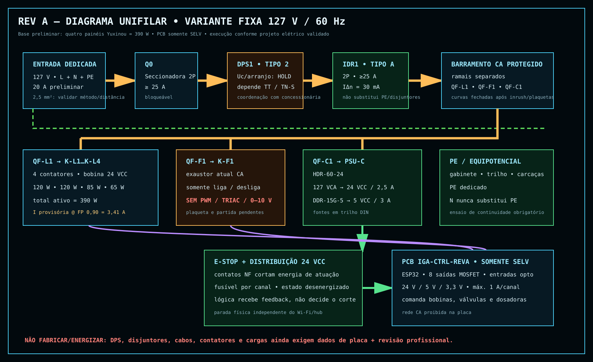
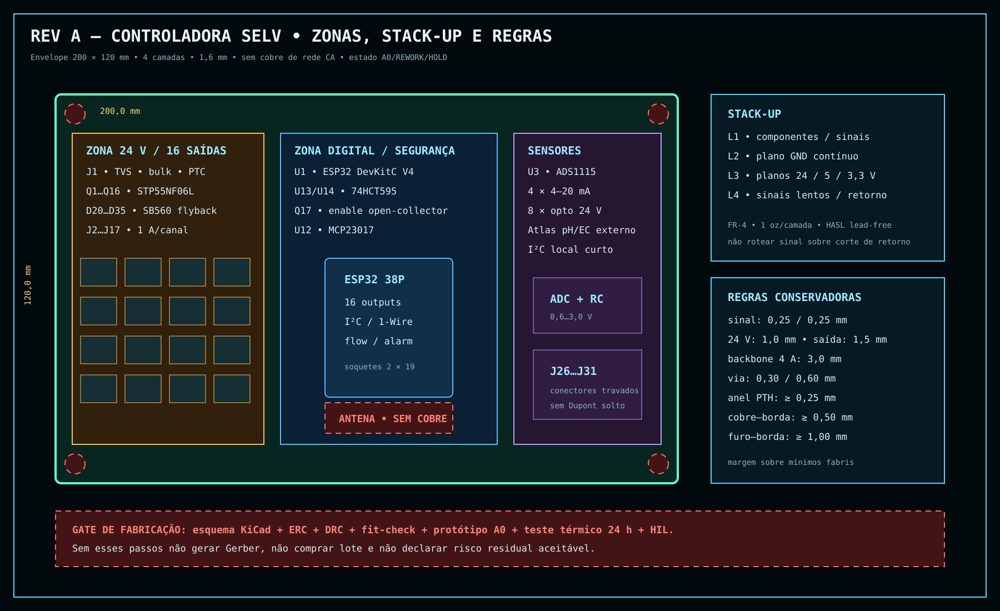

# Indoor Grow Automation

Stack open-source para automatizar fertirrigação, irrigação e ambiente de cultivo
indoor em pequena escala, composta por nós ESP32, hub local em Raspberry Pi e
painel web responsivo.

> **Status:** fundação da Fase 1. O projeto ainda não deve comandar cargas reais
> sem a conclusão dos intertravamentos, testes elétricos e comissionamento.

## Objetivos

- adquirir pH, EC, temperatura da solução, temperatura/umidade do ar, nível e
  vazamento com qualidade de dado explícita;
- controlar fertirrigação, correção química, irrigação e clima com limites e
  timeouts locais;
- manter telemetria, API e interface no hub local, sem dependência obrigatória
  de nuvem;
- oferecer documentação suficientemente detalhada para montagem por terceiros;
- preservar operação segura quando Wi-Fi, broker ou servidor falharem.

**Iluminação não faz parte deste projeto.** O responsável já possui uma
automação independente; por isso não haverá acionamento, dimerização,
fotoperíodo, carga elétrica, API ou tela de luz. Consulte o
[`escopo executável da v1.0`](docs/ESCOPO_V1.md).

## Arquitetura planejada

```text
Painel web responsivo
        │ HTTPS / WebSocket
        ▼
Hub Raspberry Pi ── API + banco + MQTT ── Wi-Fi/LAN
        │                                  │
        │                                  ├── ESP32 fertirrigação/pH/EC
        │                                  ├── ESP32 clima/VPD
        │                                  └── ESP32 segurança/I/O
        ▼
Backup, histórico e alertas locais
```

O arranjo físico padrão usa seis recipientes de concentrado de 1 L, um
reservatório de água de 50 L e um reservatório de mistura/rega de 50 L. Para
economizar piso, `TK-101` fica acima de `TK-201` em prateleiras e plataformas
independentes, dentro de um rack de no máximo 900 × 600 × 2.000 mm. Uma caixa
nunca se apoia na tampa da outra. A revisão dirigida do vídeo de hardware está em
[`docs/referencia/REVISAO_VIDEO_16MIN.md`](docs/referencia/REVISAO_VIDEO_16MIN.md).

## Estrutura

| Caminho | Responsabilidade |
|---|---|
| `firmware/` | projetos PlatformIO dos nós ESP32 |
| `hub/` | domínio, API, persistência e serviços do Raspberry Pi |
| `web/` | painel mobile-first |
| `hardware/` | esquemas, PCB, gabinetes, chicotes e BOM |
| `docs/` | arquitetura, tutoriais, ADRs e referência estudada |
| `tests/` | testes unitários, integração, simulação e HIL |
| `scripts/` | qualidade, segurança, instalação e manutenção |

## Desenvolvimento local

Requisito inicial: Python 3.12 ou superior.

```bash
python -m unittest discover -s tests -v
python scripts/quality_gate.py
```

Dependências adicionais serão introduzidas somente quando houver código que as
utilize. Segredos ficam em `.env`, que nunca é versionado.

## Roadmap

1. Núcleo de firmware e modelo confiável de sensores.
2. Controle de fertirrigação, química, clima e segurança.
3. Hub, MQTT, persistência e API.
4. Painel responsivo, histórico, setpoints e alertas.
5. Documentação de montagem, comissionamento e release v1.0.

O detalhamento executável está em [`BACKLOG.md`](BACKLOG.md); as entregas ficam
em [`CHANGELOG.md`](CHANGELOG.md) e o diário em
[`PROGRESS_LOG.md`](PROGRESS_LOG.md).

Contribuições seguem o fluxo de branches, commits, testes e releases descrito
em [`CONTRIBUTING.md`](CONTRIBUTING.md).

## Segurança física

Água e fertilizantes próximos à rede elétrica exigem projeto e execução por
profissional habilitado, aterramento, DR/GFCI, fusíveis/disjuntores, separação
CA/SELV, gabinete apropriado e contenção de vazamentos. Software não substitui
proteções mecânicas e elétricas independentes.

## Hardware Rev A

A primeira revisão própria adota instalação fixa 127 V/60 Hz, sem qualquer
ramal de iluminação, e mantém toda a rede CA fora da PCB. O pacote preliminar
inclui:

- [base elétrica de controle, hidráulica e clima](docs/hardware/rev-a/BASE_ELETRICA_127V.md);
- [BOM consolidada com disponibilidade e critérios de substituição](docs/hardware/rev-a/BOM_SISTEMA.md);
- [controladora SELV, pinagem, netlist e parâmetros](hardware/controller-rev-a/README.md);
- [laudo preliminar e gates de fabricação](docs/hardware/rev-a/LAUDO_REVISAO_REVA.md).





O estado atual é `A0/HOLD`: os arquivos servem para revisão e prototipagem, não
para fabricar lote ou energizar cargas reais.

## Visualização do sistema pronto


As [vistas realistas e suas limitações](docs/images/realistic/README.md)
mostram a aparência pretendida. Elas não substituem desenhos cotados, P&ID,
unifilar ou arquivos de fabricação.

O [caderno multidisciplinar Rev A](docs/hardware/rev-a/CADERNO_PRANCHAS.md)
reúne implantação, planta baixa, elevação, projeto hidráulico, projeto elétrico
e rotas de instalações da disposição vertical compacta.

## Origem da referência

O backlog parte de `ESPECIFICACAO_REFERENCIA.md`, produzido por análise dos
vídeos e do repositório MIT `ledgardener/gardenAutomation`. O código novo não
pressupõe que a PCB experimental publicada esteja validada.

## Licença

MIT. Componentes de terceiros mantêm seus respectivos avisos e licenças.
