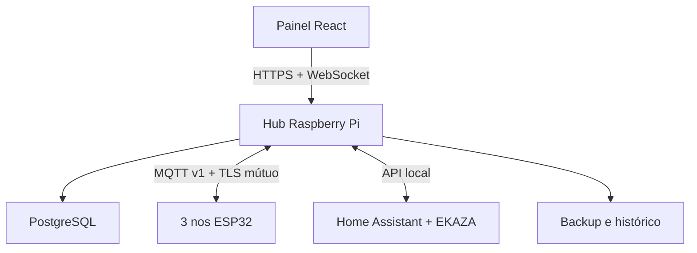

# Indoor Grow Automation

[](https://github.com/berger33/indoor-grow-automation/actions/workflows/quality.yml)

Sistema open source para automatizar **fertirrigação, irrigação, drenagem e clima**
de uma estufa indoor compacta. Três nós ESP32 executam o controle local seguro;
um Raspberry Pi hospeda MQTT, banco, API e painel; o operador configura receitas,
agendas, calibrações, alarmes e as tomadas EKAZA em uma interface responsiva.


> **Visualização conceitual do resultado esperado.** A imagem mostra a disposição
> final pretendida: quadro seco elevado, seis frascos e seis dosadoras, painel
> hidráulico central e duas caixas de aproximadamente 50 L empilhadas, cada uma
> em sua plataforma de pesagem. Dimensões, componentes e ligações finais serão
> vinculados somente pelos desenhos e pela BOM liberados após os ensaios físicos.

## Objetivo final

A release v1.0 deverá permitir que uma pessoa:

1. compre os componentes aprovados na lista final;
2. monte a estrutura seguindo o tutorial visual;
3. solicite a um profissional habilitado a instalação de 127 V;
4. instale firmware, Raspberry Pi e painel;
5. calibre massa, bombas, pH e EC;
6. comissione primeiro sem carga e depois somente com água;
7. opere fertirrigação e clima localmente, sem depender da nuvem.

O escopo vinculante e os critérios de conclusão estão em
[`docs/ESCOPO_V1.md`](docs/ESCOPO_V1.md).

## Estado atual

| Camada | Estado | O que significa |
|---|---|---|
| Controle, API, banco e painel | Implementado e testado | Fluxos principais funcionam em software |
| Firmware ESP32 | Compilável e coberto por HIL virtual | Falta validação nos nós e na placa reais |
| MQTT e segurança do hub | Implementados | TLS, ACL, ACK/NACK, auditoria e buffer offline |
| Integração EKAZA | Implementada em software | Faltam IDs reais e homologação de 100 ciclos por canal |
| Hardware Rev A | `A0/HOLD` | Requisitos definidos; KiCad, protótipo e ensaios pendentes |
| Hidráulica e mecânica | `A0/HOLD` | Fluxo definido; bombas, tubos, cotas e plataformas pendentes |
| Tutoriais 00-14 | Publicados para revisão | Falta montagem limpa e fotografias reais |
| Release | Em desenvolvimento | Ainda não é uma lista liberada para compra em lote |

O estado detalhado, incluindo todos os bloqueios físicos, esta no
[`relatório de prontidão`](docs/RELATORIO_PRONTIDAO_V1.md). O trabalho restante
fica rastreado no [`BACKLOG.md`](BACKLOG.md).

## O que o sistema automatiza

| Subsistema | Funções |
|---|---|
| Fertirrigação | seis canais calibrados, ordem de receita, mistura e limites de dose |
| Química | pH, EC, temperatura, compensação térmica, estabilizacao e correção segura |
| Água | enchimento, transferência, mistura, irrigação, coleta e drenagem |
| Clima | temperatura, umidade, VPD, exaustão, umidificação e monitoramento de CO2 |
| Segurança | E-stop, vazamento retido, nível mínimo, timeout, watchdog e safe boot |
| Supervisão | histórico, gráficos, alarmes, calibração, receitas e agendas |
| Iluminação remota | agenda e override de tomadas EKAZA existentes via Home Assistant |

CO2 é **somente monitorado**: a v1.0 não possui injeção. O sistema também não
recomenda doses agronômicas; produtos, concentrações e limites são cadastrados
pelo operador conforme fabricante e orientação aplicável.

## Iluminação fora do quadro

A potência das luminárias não integra esta automação. Elas permanecem ligadas
às tomadas Wi-Fi EKAZA existentes. O hub pode solicitar ligar/desligar pela API
do Home Assistant e confirma o resultado relendo o estado real da tomada.

Não entram no projeto elétrico da estação:

- alimentação ou cabeamento das luminárias;
- relés, contatores ou dimmers de iluminação;
- medição de PPFD;
- credenciais EKAZA nos ESP32.

Uma falha da integração de luz não bloqueia a fertirrigação nem o controle de
clima.

## Organização física esperada

O rack vertical concentra o sistema sem misturar as zonas seca e molhada:

- **topo seco:** quadro, fontes, controladora, tela e E-stop;
- **dosagem:** seis frascos de 1 L e seis bombas peristálticas;
- **centro umido:** manifold, válvulas, bombas, unioes e pontos de amostragem;
- **caixa superior:** reservatorio de água de origem, aproximadamente 50 L;
- **caixa inferior:** reservatorio de mistura/rega, aproximadamente 50 L;
- **base:** contenção secundaria e sensores de vazamento;
- **ao lado:** estufa 80 x 80 cm, exaustão, umidificação, sensores, rega e dreno;
- **zona seca separada:** Raspberry Pi, rede e armazenamento.

A imagem e uma referência de aparência e organização. Para fabricar ou montar,
prevalecem a BOM liberada, os desenhos cotados, o P&ID, o unifilar, os chicotes,
os arquivos KiCad e o tutorial da revisão aprovada.

## Arquitetura



Os ESP32 mantem os intertravamentos essenciais mesmo sem Wi-Fi, broker ou hub.
Uma reinicialização sempre volta a `BOOT` com saídas desligadas; o último comando
não é restaurado automaticamente.

## Ciclo operacional

1. Confirmar água disponível, capacidade livre e sensores validos.
2. Transferir a massa de água configurada para o tanque de mistura.
3. Misturar e águardar estabilizacao das leituras.
4. Dosar os seis canais sequêncialmente, conforme a receita cadastrada.
5. Homogeneizar e conferir EC; diluir somente dentro dos limites.
6. Corrigir pH em pulsos pequenos, impedindo pH+ e pH- simultaneos.
7. Liberar a batelada apenas com leituras estáveis e sem alarmes.
8. Irrigar as zonas conforme agenda e duracao configuradas.
9. Coletar/drenar com timeout e confirmação por massa, nível ou fluxo.
10. Manter clima por histerese e registrar comandos, feedbacks e alarmes.

Vazamento, E-stop, timeout, leitura critica invalida ou variação de massa
incompatível levam o sistema ao estado seguro local.

## Componentes principais da configuração-base

| Grupo | Configuração planejada |
|---|---|
| Controle | três nós ESP32 e controladora SELV de 16 saídas |
| Hub | Raspberry Pi 4, armazenamento endurance e backup |
| Dosagem | seis frascos de 1 L, seis peristálticas e seis agitadores |
| Reservatorios | duas caixas opacas com tampa, aproximadamente 50 L cada |
| Pesagem | oito celulas de carga e dois HX711 |
| Química | Atlas EZO pH/EC isolados e DS18B20 da solução |
| Clima | sensores redundantes de temperatura/UR, MLX90614 e SCD41 |
| Segurança | boias, vazamento fail-safe, E-stop, watchdog e proteções independentes |
| Hidráulica | transferência, mistura, irrigação, dreno, válvulas e retenções |

Consulte a [`BOM Rev A`](docs/hardware/rev-a/BOM_SISTEMA.md) para requisitos,
alternativas e estado de aprovação. Itens `HOLD` ou `PROVISIONAL` não constituem
autorizacao de compra definitiva.

## Estrutura do repositorio

| Caminho | Conteudo |
|---|---|
| `firmware/` | projetos PlatformIO dos nos de fertirrigação, clima e segurança |
| `hub/` | dominio, FastAPI, persistencia, MQTT, segurança e tempo real |
| `web/` | painel React mobile-first e Ajuda offline |
| `hardware/` | BOM, I/O, netlist, parametros e mapas do sistema |
| `desenhos/` | arquitetura, P&ID, unifilar, implantacao e vistas Rev A |
| `docs/tutorial/` | sequência completa de montagem, configuração e operação |
| `tests/` | testes unitarios, integração, simulacao e HIL |
| `deploy/` | Docker Compose ARM64, Mosquitto, segredos e persistencia |
| `scripts/` | qualidade, segurança, migracao, backup e restauração |

## Executar o portao de qualidade

Requisitos de desenvolvimento: Python 3.12+, Node.js 24, PlatformIO e Docker
para os testes de integração correspondentes.

```bash
python -m venv .venv
. .venv/bin/activate
python -m pip install --requirement requirements-dev.txt
npm ci --prefix web
python scripts/quality_gate.py
```

O gate cobre testes Python, contratos, HIL virtual, firmware, TypeScript, build
Vite, manifestos de hardware, SBOM e scanner de segredos. O Quality Gate oficial
também é executado pelo GitHub Actions em cada PR e atualização da `main`.

## Instalar no Raspberry Pi

O pacote ARM64 usa Docker Compose para iniciar PostgreSQL, Mosquitto e o hub com
healthchecks, limites e segredos montados como arquivos somente leitura.

Siga [`docs/RASPBERRY_PI_OPERACAO.md`](docs/RASPBERRY_PI_OPERACAO.md) para:

1. preparar o Raspberry Pi e o armazenamento;
2. criar certificados e segredos locais;
3. iniciar os serviços;
4. aplicar as migrações do banco;
5. acessar o painel;
6. testar backup e restauração.

Não exponha diretamente a API, o broker ou o PostgreSQL à internet.

## Tutorial de montagem e configuração

O tutorial completo esta em [`docs/tutorial/README.md`](docs/tutorial/README.md)
e deve ser seguido na ordem:

1. segurança, inventario e estrutura;
2. tanques, plataformas, hidráulica e dosadoras;
3. sensores, quadro SELV e instalação CA profissional;
4. firmware ESP32, Raspberry Pi, painel e EKAZA;
5. calibração, HIL, teste com água e primeira batelada;
6. manutenção e resposta a falhas.

Cada gate precisa ser aprovado antes de liberar a etapa seguinte. A instalação
127 V, proteções, aterramento e ensaios correspondentes são exclusivos de
profissional habilitado.

## Documentos essenciais

- [escopo executavel da v1.0](docs/ESCOPO_V1.md);
- [entrega explicada das tarefas 01-30](docs/ENTREGA_TAREFAS_01_30.md);
- [relatório de prontidão](docs/RELATORIO_PRONTIDAO_V1.md);
- [BOM e critérios de substituicao](docs/hardware/rev-a/BOM_SISTEMA.md);
- [caderno de pranchas Rev A](docs/hardware/rev-a/CADERNO_PRANCHAS.md);
- [laudo preliminar do hardware](docs/hardware/rev-a/LAUDO_REVISAO_REVA.md);
- [SBOM e licenças](docs/SBOM_E_LICENCAS.md);
- [backlog executavel](BACKLOG.md) e [histórico](CHANGELOG.md).

## Reta final para a v1.0

Antes da lista definitiva de compra e da release, ainda e necessario:

1. receber e medir amostras criticas;
2. congelar modelos, footprints, bombas, tubos e vedacoes;
3. concluir esquema e PCB no KiCad com ERC/DRC aprovados;
4. publicar desenhos mecânicos cotados, P&ID, unifilar e chicotes finais;
5. montar e ensaiar um protótipo A0;
6. executar teste térmico, HIL físico e piloto somente com água;
7. homologar cada tomada EKAZA em 100 ciclos;
8. validar o tutorial em uma montagem limpa e incluir fotografias reais;
9. fechar SBOM, release candidate e critérios de aceitação.

Enquanto esses gates estiverem abertos, o estado permanece `A0/HOLD`: o projeto
serve para engenharia, cotação e prototipagem, mas não para energização ou compra
em lote.

## Segurança

Água e fertilizantes próximos a rede elétrica podem causar choque, incêndio,
vazamento e danos materiais. Software não substitui contenção, E-stop,
aterramento, DR, disjuntores, fusível, segregação CA/SELV, gabinete apropriado e
inspeção profissional. Nunca energize uma revisão marcada como `HOLD`.

## Origem e licença

O projeto foi desenvolvido a partir da especificacao estudada nos videos e no
repositorio MIT `ledgardener/gardenAutomation`, com arquitetura, segurança,
firmware, hub e painel proprios. Consulte
[`ESPECIFICACAO_REFERENCIA.md`](ESPECIFICACAO_REFERENCIA.md).

Licenca MIT. Dependencias de terceiros mantem seus respectivos avisos e
obrigações.
