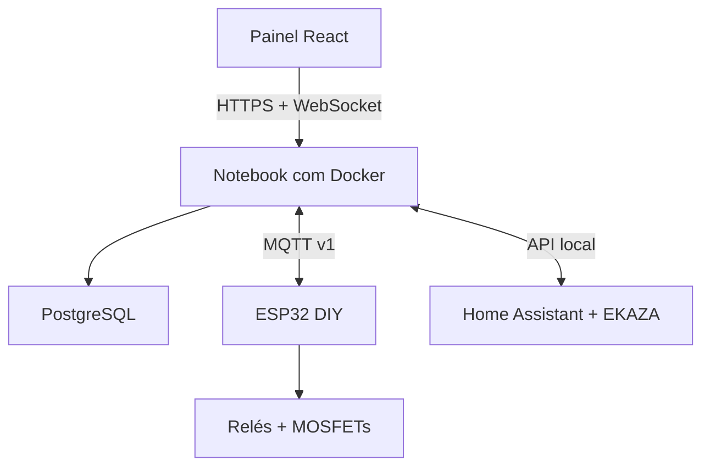

# Indoor Grow Automation

[](https://github.com/berger33/indoor-grow-automation/actions/workflows/quality.yml)

Automação local de cultivo indoor para **dosagem, irrigação, drenagem, pH/EC e
clima**, construída com peças comuns e substituíveis. A filosofia atual é
**DIY barato e funcional**: um notebook usado executa o hub em Docker e um
ESP32 genérico controla bombas e relés em uma montagem de protótipo organizada.

O projeto continua oferecendo FastAPI, PostgreSQL, Mosquitto, painel React,
histórico, alarmes, receitas, agendas, calibração e integração Home Assistant /
EKAZA. O que mudou foi a camada física: saíram PCB própria, rack sob medida,
gabinete industrial, tanques técnicos e interfaces Atlas isoladas.

> **Estado atual:** software funcional; hardware DIY ainda precisa ser montado,
> calibrado e validado primeiro com cargas simuladas e depois somente com água.
> Não use nutrientes nem deixe o sistema sem supervisão antes de concluir esses
> testes.

## Objetivo

Montar uma estação doméstica compreensível e reparável, com orçamento-base de
**R$ 1.620** para o hardware físico, sem contar o notebook já disponível, frete,
ferramentas e eventual serviço em rede elétrica.

A configuração-base usa:

- um notebook Linux ou outro computador `amd64/arm64` com Docker;
- um ESP32 DevKit genérico;
- um módulo de relé de 8 canais, com 6 canais usados e 2 reservados;
- dois módulos MOSFET de 4 canais, com 6 canais usados pelas dosadoras;
- seis bombas peristálticas pequenas de 12 V;
- três bombas de água de 12 V para mistura, irrigação e drenagem;
- sensores analógicos simples de pH e EC, DHT22, boias e vazamento;
- duas caixas organizadoras plásticas, seis potes de vidro e uma estante
  aramada comum.

Valores e fornecedores são estimativas para cotação. Nenhum anúncio específico
é obrigatório: compre pela característica técnica, confirme tensão/pinagem e
teste cada unidade recebida.

## Funções mantidas

| Subsistema | Funções |
|---|---|
| Dosagem | seis canais calibrados, receita sequencial, limite por evento/hora/dia e exclusão de pH+/pH− |
| Água | mistura, irrigação e drenagem com timeout; enchimento do reservatório é manual |
| Química | leitura analógica de pH/EC, calibração, espera de mistura e correção em pulsos |
| Clima | DHT22, exaustão e umidificação por histerese e anti-ciclo |
| Segurança | boot com saídas desligadas, botão de parada local em baixa tensão, vazamento latched e timeout absoluto |
| Supervisão | painel, histórico, alarmes, receitas, agendas e calibração |
| Iluminação | tomadas EKAZA existentes comandadas pelo Home Assistant; nenhuma fiação de luz passa pelo controlador |

O preparo usa uma receita cadastrada pelo operador. O projeto não recomenda
fertilizantes, concentrações ou alvos agronômicos universais.

## Arquitetura



O hub continua independente da plataforma: as mesmas imagens Docker rodam em
Linux `amd64` e `arm64`. Os contratos MQTT e as APIs não foram alterados pela
simplificação física.

## Mapa físico resumido

| Camada | Implementação DIY |
|---|---|
| Hub | notebook usado, Docker Compose e rede local |
| Controle | ESP32 DevKit em placa perfurada, dentro de caixa plástica seca |
| Dosagem | 6 peristálticas em 12 V por MOSFET, uma por canal |
| Atuadores | 6 canais úteis do módulo de 8 relés; 2 ficam desconectados e OFF |
| Sensores | DHT22, pH/EC analógicos, 2 boias e 2 pontos de vazamento |
| Recipientes | 2 caixas organizadoras e 6 potes de vidro de aproximadamente 1 L |
| Estrutura | estante aramada comum com fundo de madeira selada |
| Agitação | agitar manualmente cada frasco antes do uso e em toda reposição |

O [`io-map.csv`](hardware/controller-rev-a/io-map.csv) é a fonte da pinagem. O
[`actuator-map.csv`](hardware/system/actuator-map.csv) identifica função,
estado seguro e intertravamento de cada saída.

## Segurança básica

Água e eletricidade podem causar choque, incêndio e danos materiais mesmo em um
projeto simples.

- use tomada aterrada e protegida por DR existente na instalação;
- mantenha notebook, fonte, ESP32, relés, emendas e conectores acima dos
  reservatórios, em zona seca e protegida contra respingos;
- nunca deixe borne de 127 V exposto; qualquer cabo ou emenda de rede deve ficar
  em caixa fechada com alívio de tração;
- desligue da tomada antes de tocar na fiação;
- use fusível nos ramais de 12 V e fonte compatível com a corrente medida;
- forme uma alça de gotejamento nos cabos e mantenha tubos abaixo da eletrônica;
- teste vazamento, parada local, timeout e retorno de energia usando somente água;
- se precisar criar ou alterar cabo, tomada ou circuito de 127 V, contrate uma
  pessoa qualificada. O projeto não inclui painel elétrico industrial.

O botão local é um comando de parada em baixa tensão, não um E-stop certificado.

## Lista de compras

A BOM completa, os critérios de substituição e a checklist estão em
[`docs/hardware/rev-a/BOM_SISTEMA.md`](docs/hardware/rev-a/BOM_SISTEMA.md). O
CSV importável está em
[`hardware/controller-rev-a/BOM.csv`](hardware/controller-rev-a/BOM.csv).

Resumo por grupo:

| Grupo | Estimativa |
|---|---:|
| Controle, acionamento e proteção 12 V | R$ 300 |
| Bombas | R$ 405 |
| Sensores e calibração | R$ 315 |
| Recipientes e estrutura | R$ 320 |
| Tubos, fiação, caixa e acessórios | R$ 280 |
| **Total planejado** | **R$ 1.620** |

Frete e variações regionais não estão incluídos. Estante ou caixas usadas podem
reduzir o total; não economize eliminando fusíveis, caixa seca ou contenção.

## Organização do repositório

| Caminho | Conteúdo |
|---|---|
| `firmware/controller/` | firmware do ESP32 único |
| `firmware/shared/` | núcleo de timeout, estado seguro e processo |
| `hub/` | domínio, FastAPI, persistência, MQTT e integração Home Assistant |
| `web/` | painel React mobile-first |
| `hardware/` | BOM, pinagem e mapa de atuadores DIY |
| `docs/tutorial/` | montagem completa em ordem de execução |
| `archive/engenharia-pesada/` | pranchas, PCB e documentos Rev A preservados apenas como histórico |
| `tests/` | testes unitários, integração, simulação e HIL virtual |
| `deploy/` | Docker Compose, Mosquitto, segredos e persistência |

Arquivos arquivados **não descrevem a montagem atual** e não devem ser usados
para comprar, fabricar ou ligar componentes.

## Hub no notebook

Consulte [`docs/HUB_OPERACAO.md`](docs/HUB_OPERACAO.md). Em resumo:

```bash
cp deploy/.env.example deploy/.env
docker compose --env-file deploy/.env -f deploy/docker-compose.yml up -d --build
docker compose --env-file deploy/.env -f deploy/docker-compose.yml ps
```

O notebook deve permanecer ligado, sem suspensão automática e conectado à rede
local. Não exponha PostgreSQL, MQTT ou a API diretamente à internet.

## Firmware

Instale PlatformIO Core 6.1.19 e execute:

```bash
pio run --project-dir firmware/controller
pio run --project-dir firmware/hil
pio run --project-dir firmware/hil --target exec
```

O firmware considera relés normalmente ativos em nível baixo. Confirme essa
característica no módulo recebido antes de conectar qualquer carga. Sensores de
pH/EC permanecem inibidos até existir calibração válida; a saída analógica nunca
pode exceder 3,3 V no ESP32.

## Tutorial de montagem

Siga [`docs/tutorial/README.md`](docs/tutorial/README.md) na ordem:

1. comprar e conferir componentes;
2. montar ESP32, placa perfurada, MOSFETs e relés;
3. montar estante, fundo, caixas e potes;
4. instalar bombas, tubos e fiação de 12 V;
5. instalar e calibrar sensores;
6. gravar e verificar o firmware;
7. instalar o hub no notebook;
8. testar tudo apenas com água;
9. cadastrar e executar a primeira receita supervisionada.

## Portão de qualidade

Requisitos de desenvolvimento: Python 3.12+, Node.js 24, PlatformIO e Docker
para os testes de integração correspondentes.

```bash
python -m venv .venv
. .venv/bin/activate
python -m pip install --requirement requirements-dev.txt
npm ci --prefix web
python scripts/quality_gate.py
```

O gate verifica testes Python, contratos, HIL virtual, firmware, TypeScript,
build Vite, BOM/pinagem DIY, arquivo histórico e scanner de segredos.

## Estado de validação

| Camada | Estado |
|---|---|
| Hub, banco, API e painel | implementados e testados em software |
| Contratos MQTT e EKAZA | preservados |
| Firmware ESP32 DIY | compilável e coberto por HIL virtual |
| Montagem física | pendente |
| Teste somente com água | pendente |
| Primeira receita real | pendente e deve ser supervisionada |

Consulte o [`relatório de prontidão`](docs/RELATORIO_PRONTIDAO_V1.md) e o
[`BACKLOG.md`](BACKLOG.md) para os bloqueios físicos restantes.

## Origem e licença

O sistema foi inspirado na série “My DIY Home Assistant Garden Automation
System”, do canal ledgardener. A pesquisa histórica está em
[`ESPECIFICACAO_REFERENCIA.md`](ESPECIFICACAO_REFERENCIA.md); partes relacionadas
a PCB e engenharia pesada são apenas referência arquivada.

Licença MIT. Dependências de terceiros mantêm seus respectivos avisos e
obrigações.
