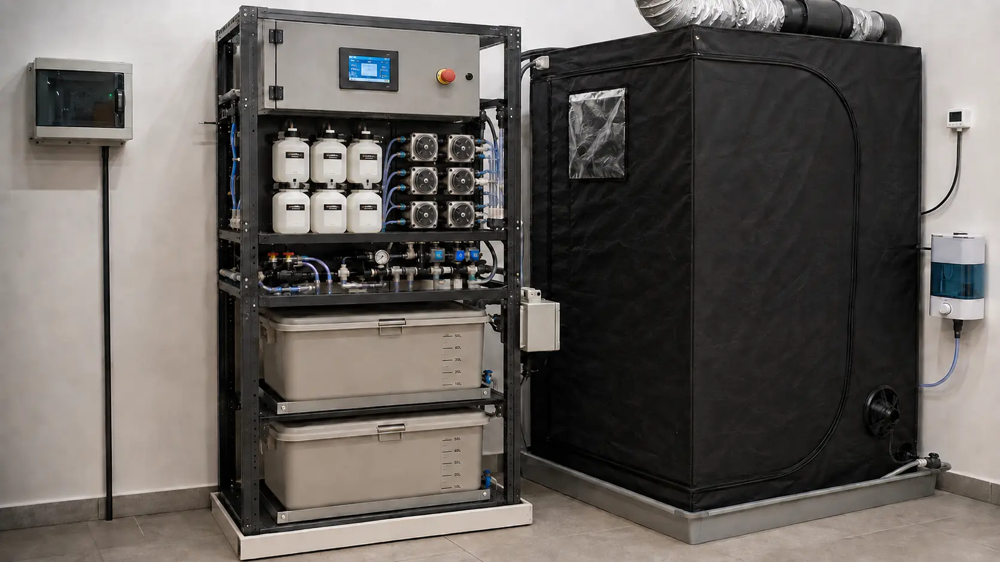

# Vistas realistas conceituais

Estas imagens ajudam a visualizar o sistema montado. Elas não retratam um
protótipo já fabricado e não substituem os documentos vinculantes de engenharia.

| Arquivo | Intenção visual |
|---|---|
| `RESULTADO_FINAL_ESPERADO_VERTICAL.webp` | vista principal do resultado esperado, com seis canais e duas caixas de 50 L empilhadas verticalmente |
| `ESTACAO_COMPLETA_CONCEITUAL.webp` | relacao espacial entre quadro seco, seis canais, dois tanques, hidráulica e tenda |
| `FERTIRRIGACAO_CONCEITUAL.webp` | aproximacao frontal dos frascos, dosadoras, bombas, válvulas, sondas e contenção |
| `CLIMA_CONCEITUAL.webp` | exaustor, umidificador, sensores na copa, bandejá e dreno |
| `ESTACAO_COMPACTA_VERTICAL_CONCEITUAL.webp` | estudo anterior da disposição vertical compacta |

## Vista principal

A vista principal consolida a direção visual aprovada:

- rack metálico compacto ao lado da estufa 80 x 80 cm;
- quadro seco elevado, tela e parada de emergência;
- seis frascos em duas fileiras de três;
- seis bombas peristálticas, uma por canal;
- painel hidráulico central;
- duas caixas opacas de aproximadamente 50 L realmente empilhadas, uma acima
  da outra, cada uma em sua própria prateleira/plataforma;
- contenção inferior, drenagem, exaustão, umidificação e sensores de clima;
- nenhuma luminaria, dimerizador ou circuito de iluminação incorporado.

## O que e vinculante

Use as imagens para compreender organização, acesso e aparência geral. Para
comprar, fabricar ou montar, prevalecem nesta ordem:

1. BOM liberada e matriz de compatibilidade;
2. P&ID e unifilar as-built;
3. desenho mecânico cotado;
4. esquema, layout, pinagem e chicotes da revisão liberada;
5. tutorial e checklist de comissionamento.

## Limitações conhecidas

- formas e dimensões dos tanques são ilustrativas até medir os recipientes reais;
- conexões, válvulas e linhas visuais não constituem o P&ID;
- suportes de frascos e agitadores ainda exigem desenho mecânico final;
- o gabinete fechado não mostra a segregação interna CA/SELV;
- sensores aparecem em posições representativas, que serão cotadas no as-built;
- nenhuma imagem autoriza ligação elétrica, escolha de proteção ou fabricação;
- iluminação foi deliberadamente omitida e não integra o hardware do sistema.

As imagens serão complementadas por fotografias da montagem validada antes da
release v1.0.
