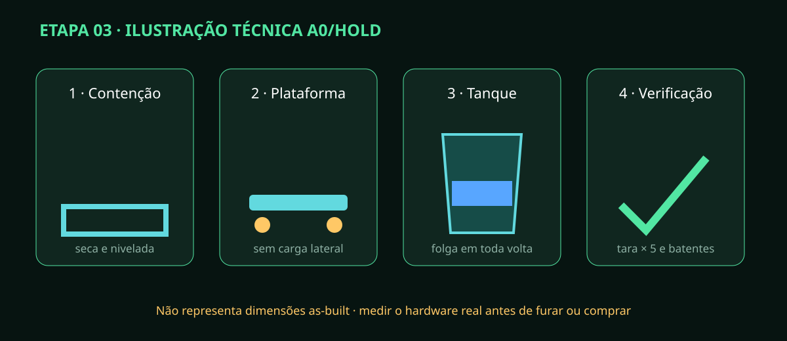

# Etapa 03 — Tanques e plataformas de pesagem

> **Estado A0/HOLD:** roteiro verificável; dimensões, células e suportes só são
> liberados após medição das amostras reais. A imagem é técnica, não fotografia.

## Resultado esperado

Cada tanque fica totalmente apoiado em sua plataforma, dentro da contenção,
sem mangueira ou parede transferir força para a balança. A tara deve retornar
ao mesmo valor em cinco ciclos de retirada e reposição.

## Antes de tocar nas peças

- Conclua a etapa 02 e mantenha toda energia desligada.
- Meça tanque vazio/cheio, tampa, conexões, contenção, plataforma e curso de retirada.
- Confirme capacidade estrutural para a massa máxima com fator definido pelo responsável.
- Separe nível, esquadro, massas rastreáveis, batentes, fixadores e planilha de ensaio.

## Passo a passo

1. Limpe a contenção `CT1`, inspecione trincas e faça teste separado com água.
2. Marque os eixos de `TK-101` e `TK-201`; não fure até conferir a prancha revisada.
3. Monte cada plataforma em superfície rígida. Aperte conforme fabricante, em cruz.
4. Passe o cabo das células sem esmagamento, laço tracionado ou contato com líquido.
5. Nivele a plataforma vazia. Nenhum pé pode perder contato quando se pressiona os cantos.
6. Instale batentes que impeçam deslocamento lateral, mantendo folga para não tocar durante a pesagem.
7. Centralize o tanque vazio e confirme folga de tampa, dreno e retirada frontal.
8. Faça a tara; retire e recoloque o tanque cinco vezes na mesma marca.
9. Aplique massas conhecidas em centro e quatro quadrantes. Registre valor bruto, erro e retorno a zero.
10. Apresente as mangueiras sem conectar: crie alívio de tração para que elas não sustentem o tanque.

## Aceitação e parada

| Verificação | Aceita quando | Pare se |
|---|---|---|
| repetição da tara | cinco retornos dentro da tolerância do projeto | houver deriva ou salto |
| carga nos quadrantes | erro dentro da tolerância aprovada | um canto divergir |
| batentes | evitam colisão sem tocar em repouso | transferirem peso |
| contenção | íntegra e removível para limpeza | houver caminho para zona seca |

Fotografe os cinco valores, fixações e folgas. Não declare calibração concluída:
a etapa 11 ainda fará a calibração com o HX711 e massa certificada.

## Estado seguro e próxima etapa

Em falha, retire tanque e massas, proteja os cabos e devolva `F5-023` a HOLD.
Somente uma inspeção aprovada libera a montagem hidráulica da etapa 04.
