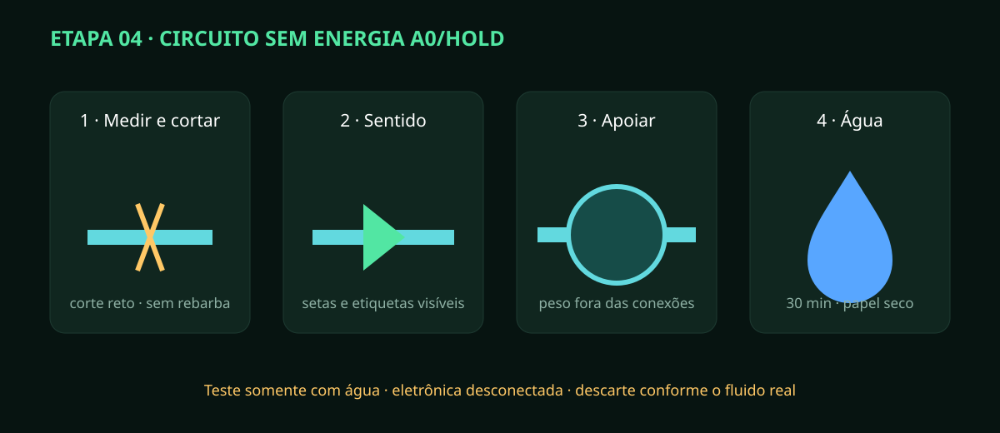

# Etapa 04 — Válvulas, bombas e tubulação

> **Estado A0/HOLD:** diâmetros, materiais, vazões e altura manométrica dependem
> de medição real (`F5-024–F5-026`). Teste inicial exclusivamente com água.

## Resultado esperado

O circuito segue o P&ID, pode ser desmontado por uniões, não força as balanças e
permanece seco externamente por 30 minutos de ensaio estático.

## Preparação

Leia `REV-A-06_PID_HIDRAULICO_COMPACTO.svg`. Separe cortador adequado, calibrador,
chaves de torque quando especificadas, etiquetas, papel absorvente e contenção.
Confirme por ficha técnica a compatibilidade de tubo, vedação e válvula com água,
nutrientes e corretores utilizados. Não escolha peça apenas pela aparência.

## Montagem sem eletrônica

1. Meça cada percurso no rack real, incluindo raio mínimo, união e acesso de manutenção.
2. Corte tubos em esquadro; remova rebarbas sem deixar resíduos internos.
3. Identifique origem, destino e sentido antes de inserir a conexão.
4. Instale registros/uniões onde tanque, bomba e filtro precisem ser removidos.
5. Oriente válvulas de retenção e bombas pela seta do fabricante.
6. Apoie o corpo de cada bomba; conexão não pode sustentar massa ou vibração.
7. Crie laços flexíveis junto aos tanques para não alterar a leitura das plataformas.
8. Mantenha dreno com queda contínua, sem ponto alto que aprisione líquido.
9. Confirme que tubos molhados não passam sobre quadro, fonte ou conector.
10. Com eletrônica desconectada, encha somente com água e purgue o ar manualmente.
11. Coloque papel seco sob cada união e observe por 30 minutos.
12. Acione manualmente apenas por método de bancada seguro e limitado, se o responsável já tiver aprovado a bomba; meça vazão e corrente separadamente.

## Evidência quantitativa

Registre trecho, material/lote, diâmetro medido, comprimento, sentido, vazão,
altura, corrente e resultado de estanqueidade. “Sem gota visível” não basta:
o papel deve permanecer seco e a massa do conjunto não pode cair além da
incerteza registrada.

Pare se houver bolha persistente, cavitação, sifão, mangueira achatada, conexão
inacessível ou esforço sobre o tanque. Esvazie para a contenção, seque e corrija
com o sistema sem energia. A aprovação libera somente a etapa 05.
