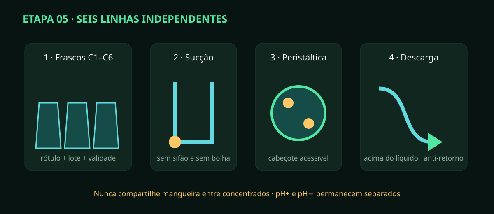

# Etapa 05 — Frascos, agitadores e seis dosadoras

> **Estado A0/HOLD:** o desenho define a função; frascos, mangueiras e bombas
> reais precisam de compatibilidade e ensaio. Nunca misture linhas químicas.

## Mapa funcional

Reserve canais independentes para CalMag, Micro, Bloom, Grow, pH− e pH+.
A receita usa nutrientes na ordem aprovada; pH é corrigido depois, pela máquina
de estados. pH+ e pH− possuem intertravamento lógico e separação física.

## Montagem

1. Fotografe rótulo, lote, validade e ficha de segurança de cada produto.
2. Etiquete frasco, sucção, cabeçote, descarga e conector com o mesmo `C1–C6`.
3. Fixe os frascos na retenção secundária; cada um deve sair sem mover o vizinho.
4. Instale pescador compatível sem encostar no agitador nem vedar a entrada de ar prevista.
5. Faça a sucção subir até a bomba sem formar sifão para o tanque de mistura.
6. Monte cada peristáltica com cabeçote acessível e tubo correto para o produto.
7. Encaminhe a descarga individualmente, com anti-retorno quando aprovado.
8. Termine a descarga acima do nível máximo e longe das sondas, evitando concentração local.
9. Separe fisicamente pH+ de pH− e deixe suas etiquetas legíveis de qualquer posição de manutenção.
10. Passe água em uma linha por vez; confirme que somente a saída correspondente molha.
11. Seque e verifique retorno, gotejamento, bolha e sifão durante 30 minutos.
12. Registre volume residual e tempo para preencher cada mangueira; não converta isso em calibração ainda.

## Inspeção obrigatória

- correspondência 1:1 entre frasco, bomba, conector e descarga;
- nenhuma união escondida, tubo dobrado ou descarga submersa;
- bandeja contém vazamento do maior frasco local;
- agitador não aquece nem arrasta a sucção;
- pH+ e pH− não compartilham ferramenta, mangueira ou recipiente.

Pare ao encontrar incompatibilidade, tubo opaco/rachado ou canal cruzado. Lave
conforme a ficha do produto e descarte corretamente. Fotografe as seis rotas e
mantenha as bombas inibidas até a calibração da etapa 11.
