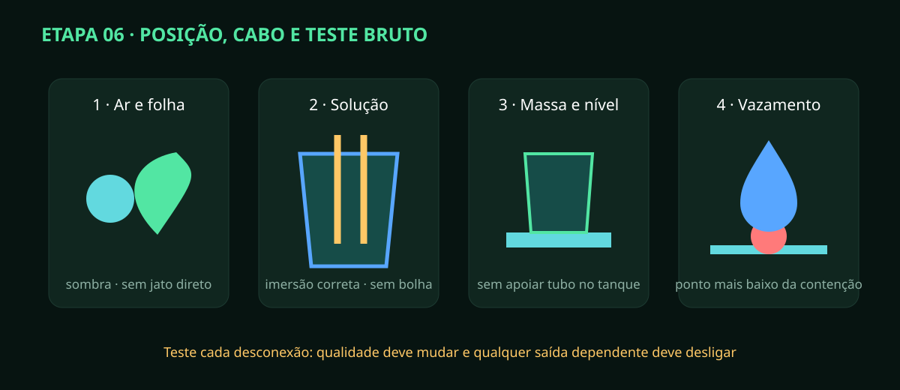

# Etapa 06 — Sondas e sensores de segurança

> **Estado A0/HOLD:** esta etapa confirma posição, identidade e leitura bruta.
> Não transforma uma leitura plausível em calibração válida.

## Sensores cobertos

DS18B20 (água), BME280 (ar/UR), MLX90614 (folha), Atlas pH/EC, ultrassônico ou
nível aprovado, HX711/células, boias e detector de vazamento. CO₂ é somente
monitorado; não existe saída de injeção nesta versão.

## Instalação por função

1. Confira modelo, endereço/barramento e etiqueta antes de conectar.
2. Posicione BME280 em ar representativo, sombreado e fora do jato do umidificador/exaustor.
3. Aponte MLX90614 para a superfície foliar sem obstrução e registre distância/campo de visão.
4. Fixe DS18B20 na zona de mistura, longe de aquecedor, entrada fria e parede.
5. Instale pH/EC na profundidade do fabricante, com fluxo suave e sem bolha presa.
6. Mantenha cabos de sonda separados de motores e CA; não enrole excesso junto à potência.
7. Posicione nível sem eco em parede/tubo; registre distância de vazio e cheio reais.
8. Garanta que tubo e cabo não apoiem peso no tanque ou plataforma HX711.
9. Instale boias com movimento livre e detector de vazamento no ponto mais baixo da contenção.
10. Faça alívio de tração e laço de gotejamento antes de qualquer conector.

## Teste seguro

Com fonte SELV limitada, leia valores brutos e depois desconecte um sensor por
vez. O painel/firmware deve trocar qualidade para falha/timeout e desligar todo
controle dependente. Molhe o detector somente conforme fabricante: a trava deve
ser retida até secagem confirmada e rearme explícito.

Registre valor, unidade, idade, qualidade, erro e horário. Compare temperaturas
co-localizadas; divergência exige inspeção, não média forçada. Guarde sondas pH/EC
na solução indicada pelo fabricante — nunca deixe a ponta de pH secar.
