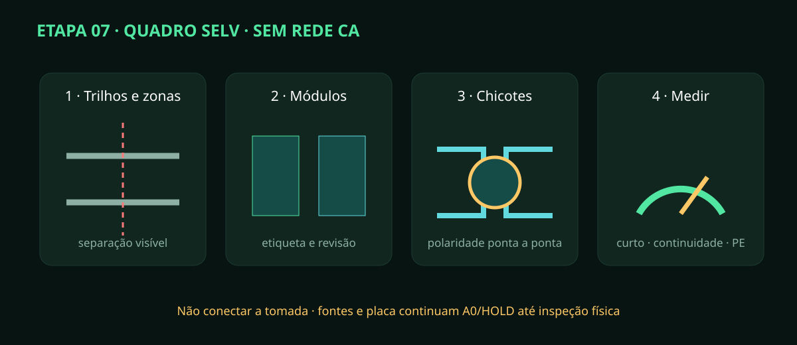

# Etapa 07 — Quadro, controladora e chicotes SELV

> **Estado A0/HOLD:** montagem somente desenergizada e no lado SELV. A PCB ainda
> depende de footprints, ERC/DRC, protótipo e ensaio físico.

## Resultado esperado

Trilhos, bornes, controladores e chicotes ficam identificados pela revisão,
com polaridade comprovada ponta a ponta. Nenhum condutor CA é conectado.

## Passo a passo

1. Compare o gabinete vazio com `REV-A-05` e `REV-A-07`; marque zonas CA/SELV/dados.
2. Instale trilhos e canaletas sem criar rebarba; remova cavacos antes dos módulos.
3. Fixe fontes, proteções SELV, bornes e os três nós ESP32 conforme a revisão aprovada.
4. Mantenha folga de ventilação e acesso a fusível, borne e botão de manutenção.
5. Fabrique um chicote por origem/destino do `io-map.csv`; use bitola e terminal aprovados.
6. Etiquete as duas pontas antes de fechar a canaleta. Não reutilize cor de função incompatível.
7. Separe sensor analógico, barramento digital e cabo de atuador; cruzamentos inevitáveis a 90°.
8. Conecte blindagem/terra funcional apenas como definido no esquema — nunca improvise PE.
9. Com tudo desligado, faça continuidade ponta a ponta e teste de curto entre polos/saída.
10. Injete tensão SELV por fonte de bancada limitada, sem atuadores, e confira polaridade em cada borne.
11. Desligue; conecte cargas simuladas e confirme que o safe boot mantém saídas desenergizadas.
12. Registre instrumento, limite de corrente, tensão, resultado e fotografia de cada borne.

## Critérios de parada

Pare ao encontrar borne frouxo, fio sem terminal, cobre exposto, aquecimento,
polaridade trocada, continuidade inesperada ou referência divergente do manifesto.
Desligue a fonte de bancada, descarregue conforme fabricante e corrija o documento
antes do chicote. A etapa 08 só começa após inspeção SELV assinada.
