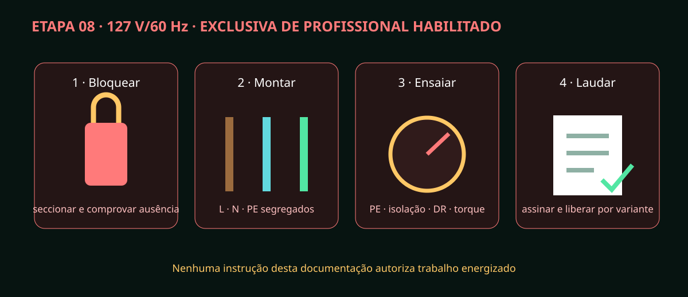

# Etapa 08 — Instalação 127 V por profissional habilitado

> **PERIGO:** esta etapa é exclusiva de profissional legalmente habilitado.
> Nenhuma instrução autoriza pessoa leiga a abrir, montar ou medir circuito CA.

## Entrega exigida do profissional

A instalação fixa é 127 V/60 Hz, com PE, seccionamento, DR e proteções definidos
pela variante aprovada. Iluminação EKAZA permanece totalmente fora do quadro.
O responsável deve revisar carga, corrente de partida, ambiente úmido, normas
aplicáveis e os desenhos antes de dimensionar qualquer componente.

## Sequência de responsabilidade técnica

1. Identificar fonte, circuito, esquema de aterramento e condições do local.
2. Seccionar, bloquear, etiquetar e comprovar ausência de tensão com procedimento/instrumento adequados.
3. Conferir plaquetas de fonte, bombas e exaustor; registrar corrente e inrush reais.
4. Dimensionar condutores, proteção, DR, seccionamento, invólucro e prensa-cabos para a instalação real.
5. Montar L, N e PE segregados do SELV conforme `REV-A-07_ELETRICO_INSTALACAO_COMPACTA.svg`.
6. Garantir continuidade de PE nas partes previstas e ausência de caminhos de líquido para CA.
7. Executar inspeção visual, torque documentado, continuidade de proteção, isolação, polaridade e ensaio do DR.
8. Energizar inicialmente sem atuadores, sob barreira e procedimento controlado.
9. Confirmar tensões secundárias e ausência de aquecimento/odor/ruído anormal.
10. Testar uma carga por vez e parada de emergência; registrar corrente e feedback.
11. Emitir laudo/registro com instrumentos, datas, resultados e não conformidades.
12. Liberar por escrito a variante exata; qualquer mudança de carga exige nova avaliação.

## O que o operador leigo pode fazer

O operador pode ler etiquetas, manter área seca, acionar controles externos
previstos e relatar dano. Não pode retirar tampa, reapertar borne, substituir
proteção, contornar DR/intertravamento ou trabalhar energizado.

Sem laudo aprovado, mantenha `A0/HOLD`, não energize e prossiga apenas com HIL
virtual. Fotografias futuras da montagem real devem ocultar dados pessoais, mas
preservar etiquetas, revisão e evidência técnica.
