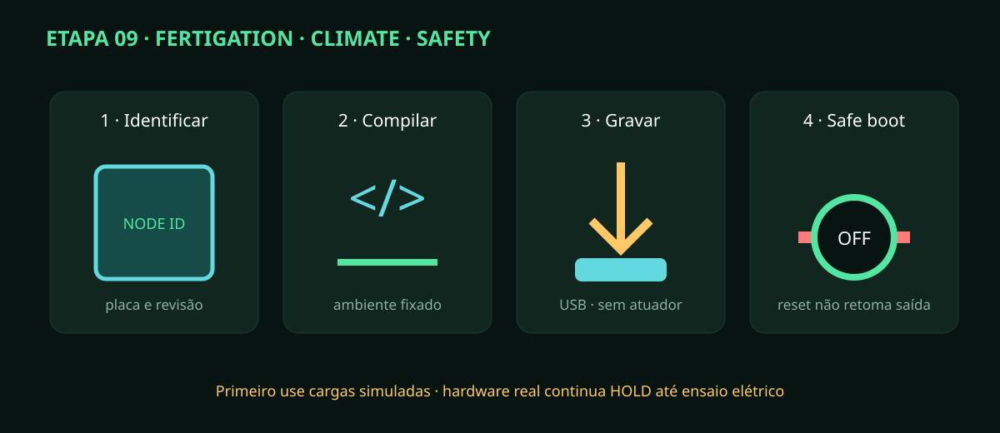

# Etapa 09 — Gravação e provisionamento dos ESP32

> **Estado:** firmware e HIL virtual compiláveis; gravação em placas e pinagem
> física permanecem A0/HOLD até inspeção do hardware.

## Três nós independentes

- `fertigation`: nível, massa, pH/EC, mistura, dosagem, irrigação e dreno;
- `climate`: temperatura, UR, VPD, CO₂, umidificador e exaustor;
- `safety`: vazamento, heartbeat, watchdog e intertravamentos independentes.

## Procedimento

1. Confira o identificador da placa e a revisão do `io-map.csv`; não troque firmware entre nós.
2. Deixe todos os conectores de atuador removidos e use somente USB/fonte SELV limitada.
3. Instale PlatformIO conforme `firmware/README.md`; não atualize plataforma ou biblioteca durante a gravação.
4. Execute o Quality Gate e confirme os seis cenários HIL nativos.
5. Compile o diretório do nó escolhido e guarde log, hash do commit e ambiente.
6. Grave por USB. Não inclua senha, certificado privado ou token no binário/repositório.
7. Abra o monitor serial na velocidade declarada e registre motivo de reset/versão.
8. Pressione reset cinco vezes: saídas devem permanecer no nível elétrico seguro.
9. Remova o heartbeat do hub durante estado simulado ativo: o nó deve abortar e reter a causa.
10. Injete comando duplicado/vencido: espere mesmo ACK para UUID repetido e NACK para sequência antiga.
11. Conecte cargas simuladas (LEDs/instrumentos), uma saída por vez, e confirme pinagem/polaridade.
12. Etiquete placa com nó, versão e data; só então instale no quadro SELV desligado.

## Aceitação

Compile limpo, boot sempre em `BOOT/OFF`, watchdog registrado, perda de rede segura,
vazamento retido e nenhum GPIO pulsando carga no reset. Falha em qualquer item
exige apagar a placa ou mantê-la identificada como reprovada; nunca “corrija”
trocando fios sem atualizar I/O e testes.
