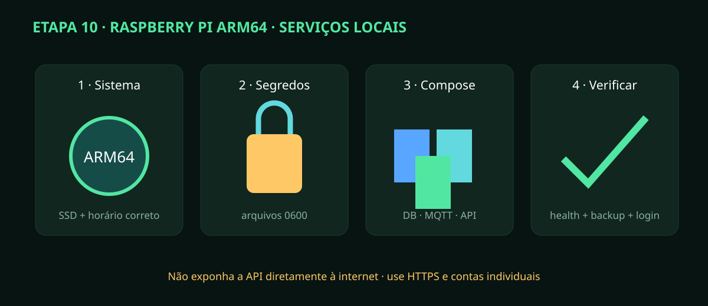

# Etapa 10 — Raspberry Pi, MQTT, API e painel

> **Estado A0/HOLD:** implantação ARM64 reproduzível em software. Desempenho, consumo,
> certificados e restauração devem ser comprovados no Raspberry/SSD reais.

## Instalação clara

1. Instale Raspberry Pi OS 64-bit em SSD confiável; atualize sistema e ajuste `America/Sao_Paulo`.
2. Instale Docker Engine/Compose pelo canal oficial do sistema e habilite inicialização.
3. Clone a revisão aprovada. Compare o hash antes de executar.
4. Copie `deploy/.env.example` para `deploy/.env`; preencha os quatro IDs EKAZA reais.
5. Crie os quatro arquivos de segredo e certificados descritos em `RASPBERRY_PI_OPERACAO.md`, com acesso mínimo.
6. Valide `docker compose ... config`; qualquer variável vazia obrigatória bloqueia a instalação.
7. Suba `db` e `broker`; confira healthcheck antes do hub.
8. Suba o hub: Alembic aplica migrações e a API serve o painel compilado.
9. Crie a primeira conta administrativa por procedimento local controlado; depois use contas individuais.
10. Faça login por HTTPS e confira estação, idade/qualidade de sensores e canal tempo real.
11. Desconecte a rede por dois minutos. O painel deve indicar offline e retomar eventos pela sequência.
12. Faça backup, copie para outro dispositivo e restaure em ambiente de teste.
13. Reinicie o Pi: o painel retorna, mas nenhuma saída ESP32 deve retomar sozinha.

## Gate de aceitação

Registre versão do Pi/OS/SSD, duração do boot, uso de RAM/disco, temperatura,
potência medida, checks do Compose, teste TLS/ACL, login por perfil, backup e
restauração. A previsão de 8–25 W é planejamento, não resultado.

Mantenha portas ligadas a localhost até existir proxy HTTPS. Nunca exponha
PostgreSQL/MQTT/API à internet nem copie tokens para issue, log ou captura de tela.
