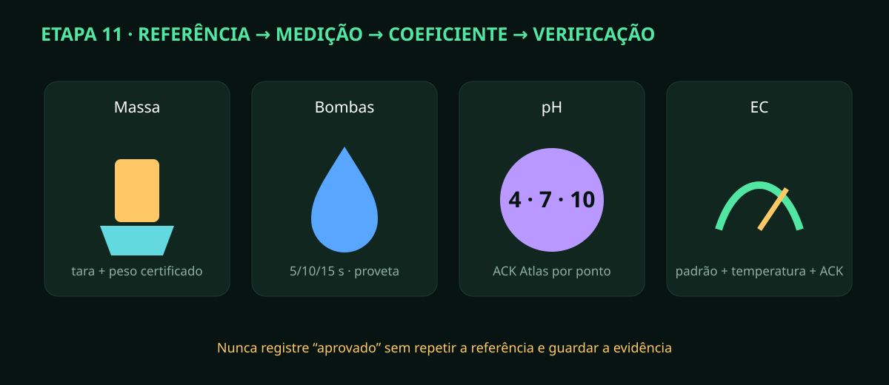

# Etapa 11 — Calibração de massa, bombas, pH e EC

> **Estado A0/HOLD:** assistente e cálculos testados. O resultado físico depende de
> referências rastreáveis, temperatura, ACK do Atlas e repetição no equipamento.

## Preparação comum

Use EPI e ficha de segurança, recipientes identificados, água apropriada,
termômetro confiável, massa certificada, proveta e padrões dentro da validade.
Abra **Calibração** no painel e selecione a estação/dispositivo correto.

## Massa / HX711

1. Esvazie e isole tubos que transmitam força. Registre contagem de tara estável.
2. Coloque a massa no centro, aguarde e registre contagem/referência.
3. O assistente calcula contagens por grama. Retire e recoloque cinco vezes.
4. Teste centro/quadrantes e reprove em deriva, contato lateral ou erro acima da tolerância aprovada.

## Bombas dosadoras

5. Use água e proveta; direcione somente uma linha. Meça tensão real.
6. Acione com limite seguro por 5, 10 e 15 s; anote os três volumes.
7. O ajuste linear reprova erro relativo máximo acima de 10%.
8. Solicite volume de verificação independente e compare; não use químico até aprovar.

## pH e EC Atlas

9. Condicione/enxágue conforme fabricante; não contamine frascos originais.
10. Informe padrões pH 4,00/7,00/10,00, aguarde estabilidade e envie cada comando.
11. O painel mantém `requires_device_ack` até o circuito confirmar e reler o padrão.
12. Para EC, registre temperatura, padrão conhecido e leitura inicial; diferença acima de 30% bloqueia.
13. Aplique compensação térmica e repita a leitura no padrão após ACK.

## Evidência e validade

Guarde lote/validade do padrão, temperatura, valores brutos, coeficiente, erro,
ACK, releitura, operador e data. Sonda sem ACK, massa não repetível ou bomba
instável permanece inibida. Nunca calibre pH em água pura nem armazene a sonda seca.
