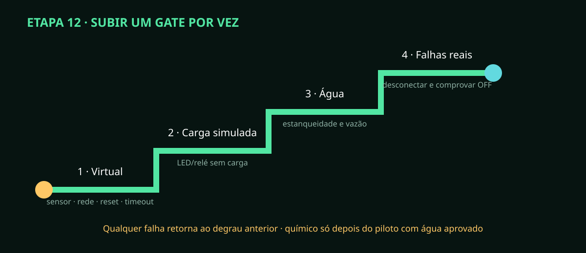

# Etapa 12 — Teste seco, HIL e piloto somente com água

> **Estado A0/HOLD:** HIL virtual aprovado; cargas, água e falhas físicas continuam
> pendentes. Suba um degrau apenas quando o anterior estiver documentado.

## Matriz mínima de falhas

| Injeção | Estado seguro esperado |
|---|---|
| sensor desconectado/CRC/timeout | qualidade falha e controle dependente OFF |
| rede/hub perdidos | comando novo rejeitado; atuação crítica abortada |
| reset durante atuação | BOOT com todas as saídas OFF |
| comando repetido/vencido | mesmo ACK sem repetir; ou NACK estável |
| vazamento confirmado | bombas/válvulas OFF e alarme retido |
| nível baixo/timeout absoluto | saída OFF e rearme somente após condição segura |

## Execução progressiva

1. Rode `scripts/quality_gate.py` e arquive logs/hashes.
2. Execute os seis cenários do HIL nativo e confira saída zero ao final.
3. No ESP32, substitua atuadores por cargas simuladas e repita reset/rede/timeout.
4. Teste cada feedback: comandado sem corrente e corrente sem comando devem alarmar.
5. Monte hidráulica sem químico, dentro da contenção, com observador e parada acessível.
6. Encha somente com água até volumes graduais; confirme massa/nível e estanqueidade.
7. Teste enchimento, mistura, irrigação, dreno, pós-tempo e umidificador dentro de limites.
8. Molhe controladamente o sensor de vazamento: verifique corte local e retenção.
9. Desligue rede e reinicie durante cada estado capaz de energizar saída.
10. Meça vazão, volume, tempo, corrente e temperatura; compare com os limites aprovados.
11. Esvazie, seque, inspecione e registre toda não conformidade.

## Gate

Não use nutrientes se qualquer falha terminar com saída ligada, se a contenção
vazar, se a restauração automática retomar comando ou se faltar evidência.
O teste com água só vira aprovado após repetição supervisionada e assinatura;
simulação não pode ser relatada como HIL físico.
