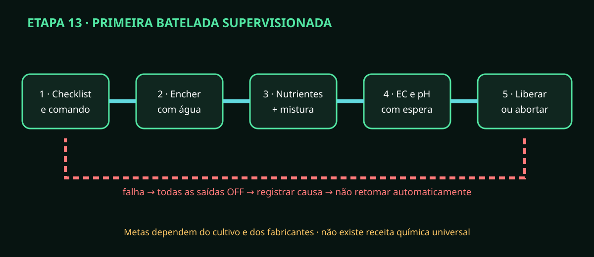

# Etapa 13 — Primeira batelada supervisionada

> **Estado HOLD:** executar somente depois de HIL físico e piloto com água
> aprovados. Metas e doses vêm de fabricante/orientação agronômica, não deste guia.

## Antes do comando

Tenha dois responsáveis presentes, EPI, fichas dos produtos, parada acessível e
recipiente para descarte. Confira água, capacidade livre, seis estoques/linhas,
calibrações válidas, dreno, contenção seca, sensores normais e alarmes reconhecidos
com causa realmente corrigida.

## Sequência supervisionada

1. Selecione a receita revisada; compare lote/concentração com o cadastro.
2. Revise volume, alvos de pH/EC e quatro volumes nutritivos. Não edite para “compensar” sensor suspeito.
3. Marque o checklist no painel e envie início. `queued` não significa bomba ligada.
4. Aguarde ACK do firmware e confirme enchimento por massa, nível e inspeção visual.
5. Observe dosagem fixa CalMag → Micro → Bloom → Grow, com mistura entre etapas.
6. Compare volume previsto/real de cada canal; aborte na primeira divergência.
7. Aguarde homogeneização e estabilidade; só então avalie EC.
8. Se EC alto, a diluição usa apenas capacidade reservada e timeout absoluto.
9. Corrija pH em pulsos pequenos, com banda morta e espera; pH+ e pH− nunca simultâneos.
10. Registre valores finais estáveis e autorize irrigação somente se todos os intertravamentos estiverem livres.
11. Observe retorno/dreno e pós-tempo; confirme que nenhuma bomba permanece ligada.
12. Feche o relatório com consumo, duração, alarmes, desvios e destino da solução.

## Abortar e não retomar

Em vazamento, sensor inválido, estoque inesperado, feedback ausente, timeout ou
erro químico: use parada segura, preserve o alarme, contenha e identifique o
líquido. Nunca continue manualmente a etapa “que faltou”. Uma nova batelada exige
causa corrigida, inspeção e novo comando desde estado seguro.
