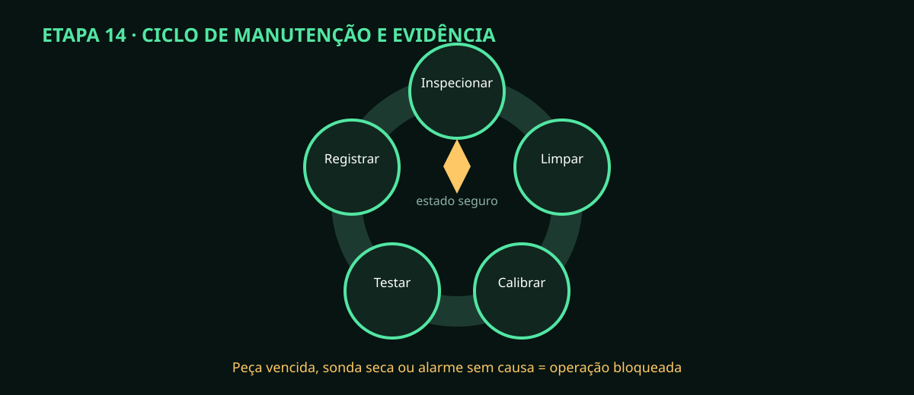

# Etapa 14 — Manutenção, limpeza e resposta a falhas

> **Estado A0/HOLD:** plano inicial. Frequências finais dependem de fabricante, química,
> ambiente e dados do piloto; nenhuma estimativa substitui inspeção.

## Rotina sugerida até validação

| Frequência inicial | Ação | Registro |
|---|---|---|
| antes de cada operação | vazamento, níveis, tubos, dreno, alarmes e parada | checklist do operador |
| semanal | bandejas, filtros, cabeçotes, cabos e fixações | foto e não conformidade |
| mensal | teste de timeout, safe boot, watchdog, heartbeat, backup e restauração amostral | log/hash/resultado |
| conforme fabricante | limpeza, solução de armazenamento e calibração pH/EC | lote, temperatura e ACK |
| após troca de linha/bomba | estanqueidade, vazão e calibração | curva e erro |
| trimestral inicial | teste de restauração completo e revisão de usuários | relatório/auditoria |
| por profissional | DR, PE, torque, isolação e inspeção CA | laudo aplicável |

## Procedimento seguro

1. Termine/aborte o processo pelo fluxo previsto e confirme todas as saídas OFF.
2. Seccione e bloqueie as energias exigidas pela atividade; CA somente por profissional.
3. Identifique solução residual e consulte a ficha antes de drenar ou limpar.
4. Use ferramenta/recipiente exclusivo por químico, principalmente pH+ e pH−.
5. Inspecione do ponto molhado para o seco, procurando caminho de vazamento.
6. Troque peça por MPN aprovado; registre lote e motivo, sem substituição silenciosa.
7. Refaça o teste correspondente: vedação, continuidade, calibração ou HIL.
8. Atualize horas/ciclos e próxima data; só libere sem alarme pendente.

## Resposta e armazenamento

Sonda pH deve permanecer na solução indicada; nunca em água pura ou seca. EC,
tubos e bombas seguem o fabricante e compatibilidade química. Em vazamento,
contenha e corrija antes do rearme. Em corrupção de dados, preserve disco/logs,
restaure cópia verificada e compare auditoria.

Peça vencida, tubo rachado, sonda seca, backup não testado ou causa de alarme
desconhecida mantém a operação bloqueada. O relatório de prontidão lista esses
itens até haver evidência física.
