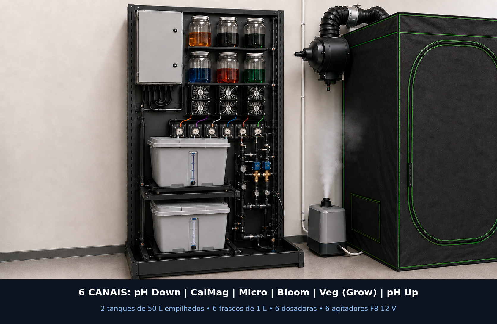
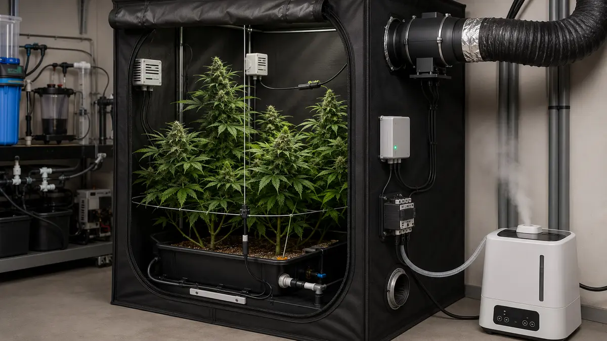

# Arquitetura física-alvo da estação

Este documento fixa a organização funcional derivada do vídeo V1 e adaptada aos
volumes informados. Dimensões cotadas só serão congeladas depois da medição dos
tanques e do local.

O ADR 0007 substitui a disposição excessivamente espalhada da primeira vista
por um rack vertical inspirado no princípio espacial observado no vídeo. O
[`estudo dirigido do painel`](../../referencia/ESTUDO_PAINEL_COMPACTO.md) separa
evidências visuais de adaptações de segurança.

## 1. Zonas físicas

| Zona | Conteúdo | Regra de posicionamento |
|---|---|---|
| A — quadro seco | proteções CA, fontes, controladora, bornes, HMI e E-stop | alto à esquerda, fechado e lateralmente afastado dos frascos |
| B — dosagem | seis frascos de 1 L, seis agitadores e seis peristálticas | duas fileiras de três à direita, com bombas no painel seco adjacente |
| C — água | `TK-101` de 50 L, plataforma, boias e bandeja `CT2` | nível intermediário próprio, acima de `TK-201`, sem contato entre caixas |
| D — mistura | `TK-201` de 50 L, plataforma, sondas e bomba | nível inferior dentro de `CT1`, tampa acessível e sem esforço na balança |
| E — hidráulica | bombas, válvulas, manifold, uniões e dreno | coluna lateral removível que atende os dois níveis sem passar sobre o quadro |
| F — cultivo | emissores, bandeja de coleta, dreno e sensores climáticos | nenhum equipamento de rede exposto à névoa/rega |
| G — hub | Raspberry Pi, rede e armazenamento | caixa seca, ventilada e acessível para backup |

Mangueiras nunca passam sobre as zonas A ou G. Cabos que sobem de uma zona
molhada formam laço de gotejamento antes do prensa-cabo.

## 1.1 Envelope compacto A0

| Parâmetro | Meta A0 | Estado |
|---|---:|---|
| rack | máximo 900 × 600 × 2.000 mm | provisional; confirmar modelo/carga |
| área de piso do rack | máximo 0,54 m² | redução de 25% sobre a revisão anterior |
| faixa frontal de manutenção | mínimo 900 mm | conferir no ambiente |
| tanque individual | máximo provisório 700 × 450 mm | HOLD por medição externa e curso da tampa |
| `CT2` superior | bandeja com dois drenos por gravidade | HOLD por vazão e ensaio de obstrução |
| `CT1` inferior | mínimo 110 L livres já descontados obstáculos | HOLD por cálculo geométrico e ensaio |
| prateleira por tanque | mínimo 100 kg documentados | HOLD por fabricante e ensaio de flecha |
| carga total do rack | mínimo 250 kg distribuídos | HOLD por cálculo, fabricante e ancoragem |

O rack não poderá ser comprado antes de conferir carga, dimensões dos tanques,
flecha de cada nível, ancoragem e risco de tombamento com `TK-101` cheio. O
tanque superior nunca se apoia na tampa, nas paredes ou na plataforma do tanque
inferior. O painel de fundo deve ser selado e removível; madeira crua não é
superfície final aprovada.

## 2. Capacidade de atuação

O vídeo usa seis dosadoras, quatro bombas hidráulicas, duas válvulas, agitação,
exaustão e umidificação. Isso exige **15 funções comandadas**, portanto a antiga
premissa de oito saídas não atende ao sistema inteiro.

A controladora A0 será revisada para 16 saídas com habilitação segura única. O
mapa vinculante está em
[`hardware/system/actuator-map.csv`](../../../hardware/system/actuator-map.csv).
Cargas acima de 1 A ou com corrente de partida desconhecida usam driver/contator
externo e fusível próprio; a PCB fornece apenas o comando.

### 2.1 Banco original de agitação/dosagem

Os seis recipientes formam duas fileiras de três. Cada frasco fica imediatamente
sobre um ventilador ARCTIC F8 PWM de 80 mm usado em 12 V e velocidade total. Dois
ímãs simétricos presos ao rotor movimentam uma barra revestida em PTFE dentro do
frasco. O sistema próprio mantém esse princípio, acrescenta proteção física para
conter ímã solto e lê os seis tacômetros antes e durante a dosagem.

| Índice | Produto neste projeto | Nome no original | Conjunto físico |
|---:|---|---|---|
| 0 | pH Down | pH Down | `B1/M1/PD1` |
| 1 | CalMag | CalMag | `B2/M2/PD2` |
| 2 | Micro | Micro | `B3/M3/PD3` |
| 3 | Bloom | Bloom | `B4/M4/PD4` |
| 4 | Veg | Grow | `B5/M5/PD5` |
| 5 | pH Up | pH Up | `B6/M6/PD6` |

`OUT07` habilita `DC2`, um conversor 24→12 V dedicado. Os ventiladores são
ligados em grupo; a rotação é confirmada por canal. A identidade e a sequência
executáveis ficam em
[`stirrer-contract.json`](../../../hardware/system/stirrer-contract.json), e a
montagem guiada está no
[`Tutorial 05`](../../tutorial/05-frascos-dosadoras-agitadores.md).

## 3. Aquisição distribuída

- pH, EC, temperatura da solução, massa e boias ficam na estação de mistura;
- detectores de vazamento cobrem dosagem, dois tanques e cultivo/dreno;
- temperatura, UR, CO₂ e temperatura foliar ficam em nó SELV ventilado no
  cultivo, fora do jato do umidificador;
- o nó de clima envia dados por barramento diferencial cabeado ao controlador;
  Wi-Fi/MQTT é telemetria e configuração, não o único caminho de segurança;
- I²C não percorre o ambiente nem cabos longos.

O padrão físico do barramento diferencial ainda será escolhido entre RS-485 e
CAN após análise de cabos, transceptores e firmware. Até essa decisão, nenhum
conector de campo correspondente está liberado para fabricação.

## 4. Fluxo hidráulico funcional

1. a entrada enche o tanque de água até limite de massa/boia;
2. válvula e bomba transferem a quantidade prevista ao tanque de mistura;
3. a mistura circula por 5 s antes de habilitar os seis agitadores;
4. com rotação confirmada, a receita dosa CalMag, Micro, Bloom e Veg (`Grow` na
   referência), nessa ordem e com 60 s entre componentes;
5. os agitadores desligam, a solução repousa 60 s e água dilui até o alvo de EC
   ou o limite seguro de volume;
6. pH Up/Down pertencem a uma rotina separada, mutuamente exclusiva e somente
   após pausas de homogeneização;
7. uma batelada aprovada alimenta a bomba de irrigação;
8. bandejas coletam retorno, que é drenado ao destino configurado;
9. qualquer divergência de massa, timeout ou vazamento fecha válvulas e desliga
   bombas localmente.

O P&ID final definirá válvulas de retenção, registros manuais, uniões, diâmetros,
sentido de fluxo e pontos de amostragem. A aparência de uma mangueira no vídeo
não é critério de dimensionamento.

## 5. Manutenção incorporada ao layout

- todos os seis frascos saem pela frente sem remover mangueiras de outros canais;
- `TK-101` e `TK-201` saem pela frente do respectivo nível somente depois de
  drenados; nenhuma manutenção exige levantar manualmente um tanque cheio;
- cabeçotes peristálticos e tubos são substituíveis individualmente;
- sondas podem ser retiradas, limpas e armazenadas sem esvaziar o quadro;
- bombas e válvulas possuem união nos dois lados;
- plataformas de pesagem têm batentes contra sobrecarga e não recebem esforço
  lateral de mangueiras;
- a bandeja `CT2` pode ser testada com água em cada dreno, e `CT1` pode ser
  inspecionada e esvaziada sem desmontar o rack;
- cada cabo, tubo, borne, fusível, canal e sentido de fluxo recebe identificador;
- bandejas e piso permitem testar cada sensor de vazamento sem molhar eletrônica.

Consulte as [limitações das vistas realistas](../../images/realistic/README.md)
antes de usar qualquer detalhe visual.

## 6. Estado da arquitetura

`A0 / REWORK / HOLD`: a fronteira, as funções e a direção compacta estão
definidas. A controladora possui envelope de 16 saídas; barramento e footprints
continuam abertos antes do KiCad. O
[`caderno de pranchas`](CADERNO_PRANCHAS.md) reúne implantação, planta baixa,
elevação, P&ID, elétrica e instalações. Imagens realistas são auxílio visual e
não substituem desenho as-built, BOM ou inspeção profissional.
