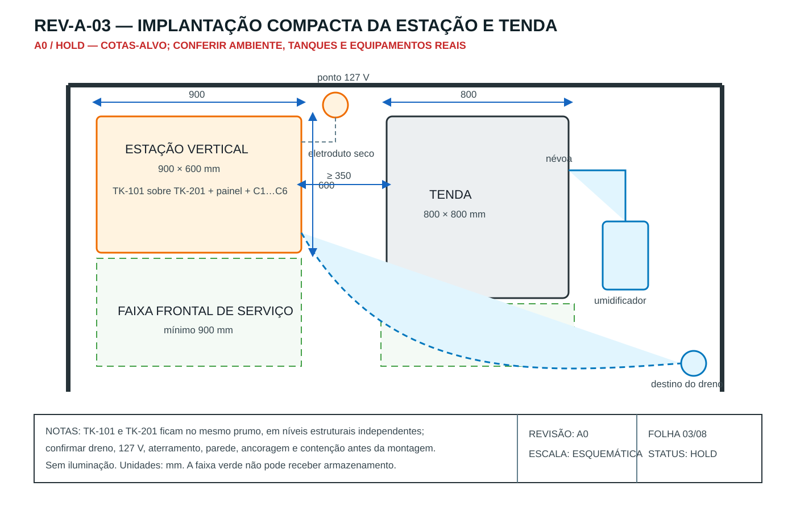
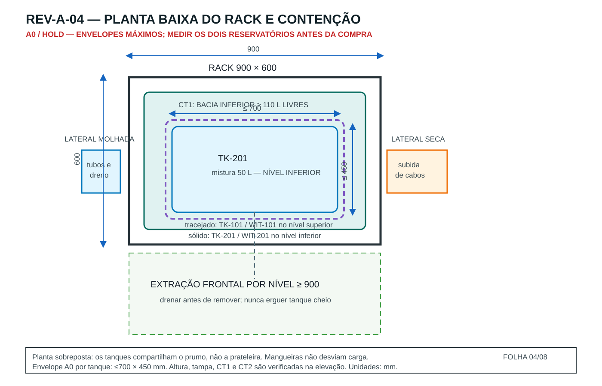
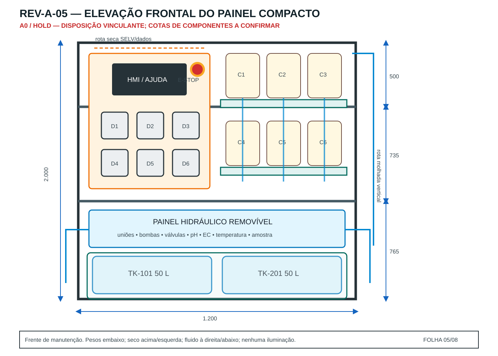
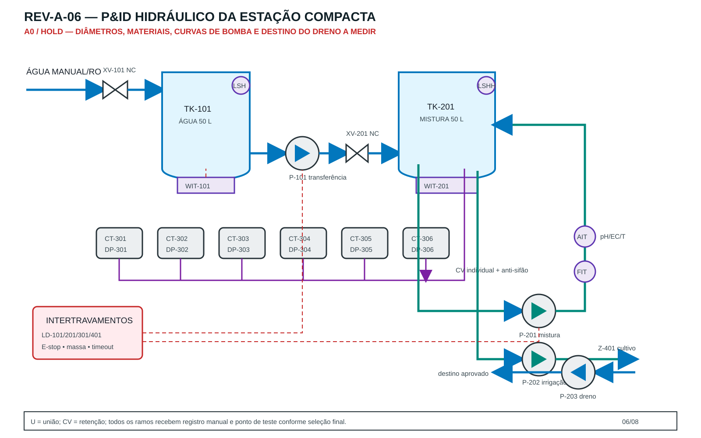
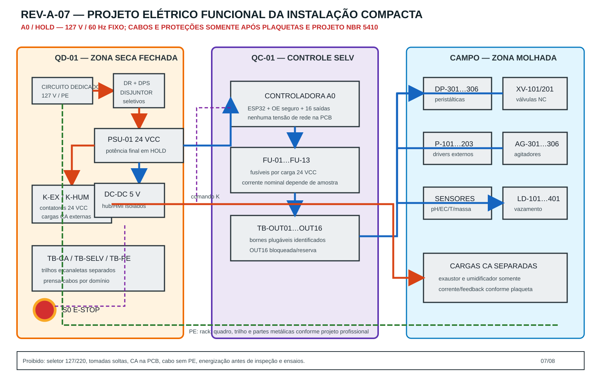
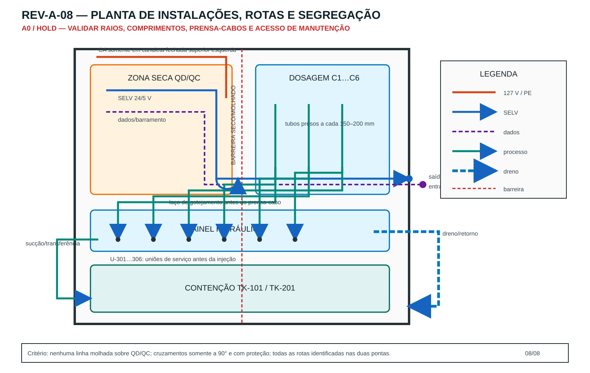

# Caderno de pranchas — implantação compacta Rev A

> Estado documental: `A0/HOLD`. As pranchas descrevem intenção de projeto e
> envelopes máximos. Não são as-built, não liberam compra nem ligação elétrica.

## Índice controlado

| Folha | Arquivo | Disciplina | Uso | Falta para liberar |
|---:|---|---|---|---|
| 01 | `REV-A-01_UNIFILAR_127V.svg` | elétrica | alimentação fixa e fronteira CA/SELV | plaquetas, circuito e revisão profissional |
| 02 | `REV-A-02_PCB_ZONAS.svg` | eletrônica | zonas da controladora SELV | KiCad, footprints, ERC/DRC e protótipo |
| 03 | `REV-A-03_IMPLANTACAO_COMPACTA.svg` | implantação | posição do rack, tenda e acessos | levantamento real do ambiente |
| 04 | `REV-A-04_PLANTA_BAIXA_RACK.svg` | mecânica | prumo comum dos tanques, contenção e extração frontal | dimensões reais dos tanques |
| 05 | `REV-A-05_ELEVACAO_PAINEL_COMPACTO.svg` | mecânica | dois níveis estruturais independentes e módulos superiores | amostras e suportes medidos |
| 06 | `REV-A-06_PID_HIDRAULICO_COMPACTO.svg` | processo | fluxo, instrumentos e intertravamentos | vazões, alturas, materiais e dreno |
| 07 | `REV-A-07_ELETRICO_INSTALACAO_COMPACTA.svg` | elétrica | distribuição funcional por zona | cálculo, seletividade, cabos e laudo |
| 08 | `REV-A-08_INSTALACOES_ROTAS.svg` | instalações | rotas CA, SELV, dados, tubos e dreno | comprimentos e prensa-cabos reais |

## Hierarquia de autoridade

Em conflito entre documentos, prevalece a revisão liberada nesta ordem:

1. P&ID e matriz de causa/efeito;
2. unifilar, esquema e lista de cabos;
3. desenhos mecânicos cotados e as-built;
4. BOM/AVL e fichas técnicas aprovadas;
5. tutorial da mesma revisão;
6. imagens realistas, somente para compreensão visual.

## Implantação

O rack ocupa envelope máximo A0 de 900 × 600 mm, ao lado da tenda de 800 × 800
mm, com faixa frontal mínima de 900 mm. Isso reduz o piso da estação a 0,54 m².
A planta não fixa a posição definitiva do ponto 127 V nem do dreno: ambos
dependem do levantamento do local.

## Planta baixa

A planta sobrepõe os envelopes: `TK-101` está no nível intermediário e `TK-201`
no nível inferior, ambos no mesmo prumo. O envelope máximo provisório de cada
tanque é 700 × 450 mm. A bandeja `CT2` drena o nível superior para a bacia
`CT1`, que deve demonstrar 110 L livres já descontados todos os obstáculos.

## Elevação do painel

O arranjo replica o princípio espacial do vídeo: comando/dosagem no alto à
esquerda, seis recipientes em duas fileiras à direita, hidráulica em coluna
lateral e reservatórios um acima do outro. Cada tanque tem prateleira e
plataforma próprias; `TK-101` nunca apoia em `TK-201`. Eletrônica e fluido
permanecem segregados.

## Projeto hidráulico

Os identificadores `TK`, `P`, `XV`, `DP`, `WIT`, `AIT`, `FIT` e `LD` serão
preservados na BOM, software, etiquetas, chicotes e tutorial. Diâmetros e
modelos continuam em HOLD até o levantamento hidráulico e ensaio de bancada.

## Projeto elétrico

A instalação é fixa em 127 V/60 Hz. Rede fica no quadro seco, a controladora é
somente SELV e cargas desconhecidas usam drivers externos protegidos. A folha
não substitui projeto executivo conforme NBR 5410 nem trabalho habilitado.

## Planta de instalações

CA sobe pela lateral seca; SELV e dados usam canaletas próprias; tubos e dreno
ficam no lado molhado. Os dois drenos de `CT2` descem de modo visível até `CT1`.
Cruzamentos inevitáveis são perpendiculares e protegidos.

## Critérios para revisão A1

- levantamento dimensional assinado, com fotos e croqui do ambiente;
- massa/carga total do rack, carga e flecha de cada prateleira verificadas;
- dimensões dos recipientes, tampas e curso de retirada por nível confirmados;
- contenção em cascata ensaiada com obstrução simples de cada dreno;
- P&ID atualizado com diâmetro, material, curva e tag de cada componente;
- lista de cabos, conectores, prensa-cabos e comprimentos;
- projeto elétrico revisado por profissional habilitado;
- esquema/PCB com ERC e DRC zerados ou justificativas aprovadas;
- protótipo unitário, estanqueidade, HIL e piloto somente com água.
